# Risk Dashboard - Use Case Detailed Documentation

Tài liệu này cung cấp các phân tích nghiệp vụ chi tiết và sơ đồ trình tự (Sequence Diagrams) cho từng ca sử dụng (Use Case) trong hệ thống Phân tích rủi ro định lượng thị trường chứng khoán Việt Nam (Risk Dashboard).

## Tổng quan hệ thống

Hệ thống hoạt động theo mô hình tích hợp: **Thu thập dữ liệu vĩ mô/thị trường $\rightarrow$ Động cơ lượng hóa (XGBoost, GARCH, HMM, VaR) $\rightarrow$ Hệ thống Multi-agent LLM (LangGraph) $\rightarrow$ Giao diện Web SPA (React + Vite)**. Kiến trúc chia tách thành các module độc lập được đăng ký động tại Backend FastAPI nhằm phục vụ các vai trò người dùng chuyên biệt.

---

## Danh sách ca sử dụng (Use Cases)

1. [Xem tổng quan rủi ro (UC_ViewRisk)](#1-xem-tong-quan-rui-ro-uc_viewrisk)
2. [Phân tích tin tức thị trường (UC_AnalyzeNews)](#2-phan-tich-tin-tuc-thi-truong-uc_analyzenews)
3. [Tính điểm ưu tiên tin tức (UC_CalcImportance)](#3-tinh-diem-uu-tien-tin-tuc-uc_calcimportance)
4. [Tạo báo cáo EOD tự động (UC_EODReport)](#4-tao-bao-cao-eod-tu-dong-uc_eodreport)
5. [Chạy mô hình dự báo XGBoost (UC_RunXGBoost)](#5-chay-mo-hinh-du-bao-xgboost-uc_runxgboost)
6. [Quản lý danh mục theo dõi (UC_Watchlist)](#6-quan-ly-danh-muc-theo-doi-uc_watchlist)
7. [Tương tác trợ lý AI (UC_AIChat)](#7-tuong-tac-tro-ly-ai-uc_aichat)
8. [Chạy kịch bản Stress-test (UC_StressTest)](#8-chay-kich-ban-stress-test-uc_stresstest)

---

## Chi tiết từng Use Case

### 1. Xem tổng quan rủi ro (UC_ViewRisk)

#### Mô tả
Cho phép Học sinh/sinh viên hoặc Quản trị viên xem điểm số rủi ro hiện tại và xu hướng dự báo biến động thị trường chứng khoán Việt Nam qua các kỳ hạn (1 tuần, 2 tuần, 1 tháng) được mô hình hóa tự động.

#### Actors
- Primary: Học sinh/sinh viên, Quản trị viên (Admin)
- Secondary: Không có

#### Pre-conditions
- Hệ thống đã hoàn thành chạy EOD ít nhất một lần để có mô hình lượng hóa và dữ liệu điểm số rủi ro lưu trong cơ sở dữ liệu.

#### Main Flow
1. Học sinh/sinh viên mở ứng dụng hoặc truy cập trang Dashboard.
2. Giao diện React SPA gửi yêu cầu lấy dữ liệu lịch sử và dự báo rủi ro vĩ mô (`GET /dashboard/history`).
3. Backend FastAPI nhận request, truy vấn lịch sử điểm số lượng hóa trong SQLite database.
4. Backend gọi hàm lượng hóa `predict_horizons` để lấy xác suất rủi ro dự đoán của mô hình XGBoost đang hoạt động.
5. Trả về payload JSON chứa dữ liệu lịch sử và dự đoán.
6. React SPA dựng giao diện biểu đồ và phân loại mức độ rủi ro (Risk Regime).

#### Post-conditions
- Học sinh/sinh viên quan sát được biểu đồ xu hướng lượng hóa rủi ro và các kịch bản dự đoán hiện tại.

#### Sequence Diagram
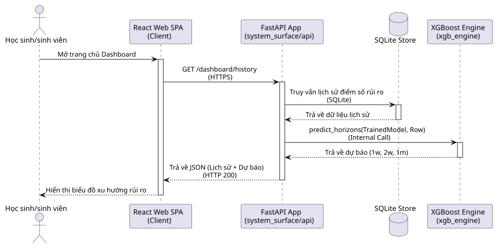

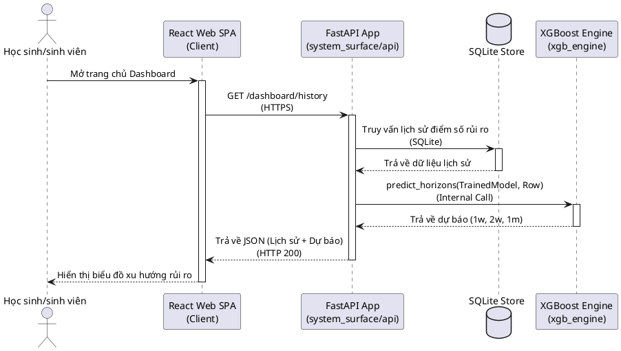

---

### 2. Phân tích tin tức thị trường (UC_AnalyzeNews)

#### Mô tả
Tự động tải các nguồn tin tức RSS tài chính (trong và ngoài nước), phân loại chủ đề (vĩ mô, lãi suất, tỷ giá) và gọi công cụ chấm điểm tầm quan trọng để cập nhật lên bảng tin tức thời gian thực.

#### Actors
- Primary: Hệ thống tự động (System Agent)
- Secondary: VNStock API (External System)

#### Pre-conditions
- Bộ lập lịch (Hệ thống tự động) đến chu kỳ kích hoạt hoặc quản trị viên gửi lệnh đồng bộ thủ công (`POST /feed?force=true`).

#### Main Flow
1. Hệ thống tự động gửi request trigger đồng bộ tin tức lên dịch vụ `NewsIntelligenceService`.
2. Dịch vụ gọi `NewsRssProducer.fetch()` để quét đồng thời các nguồn cung cấp tin.
3. Trình thu thập gửi yêu cầu lấy dữ liệu XML RSS tới máy chủ VNStock và các nguồn tin tài chính ngoại.
4. Nhận về dữ liệu tin tức thô và tiến hành phân tích, gán nhãn làm giàu (`enrich_article`).
5. Gọi ca sử dụng `Tính điểm ưu tiên tin tức` (UC_CalcImportance) để xác định điểm số mức độ quan trọng.
6. Lưu trữ các bài viết và điểm số của chúng vào SQLite database.
7. Cập nhật trạng thái sức khỏe của nguồn tin (source_health).

#### Alternative Flows
- Nếu một nguồn tin RSS bị lỗi kết nối hoặc phân tích XML thất bại, hệ thống ghi nhận lỗi vào `source_health` với trạng thái `degraded` hoặc `partial`, tiếp tục xử lý các nguồn tin tiếp theo mà không dừng ứng dụng.

#### Post-conditions
- Cơ sở dữ liệu tin tức được cập nhật với các bản tin mới nhất kèm theo phân loại chủ đề và điểm số tầm quan trọng.

#### Sequence Diagram
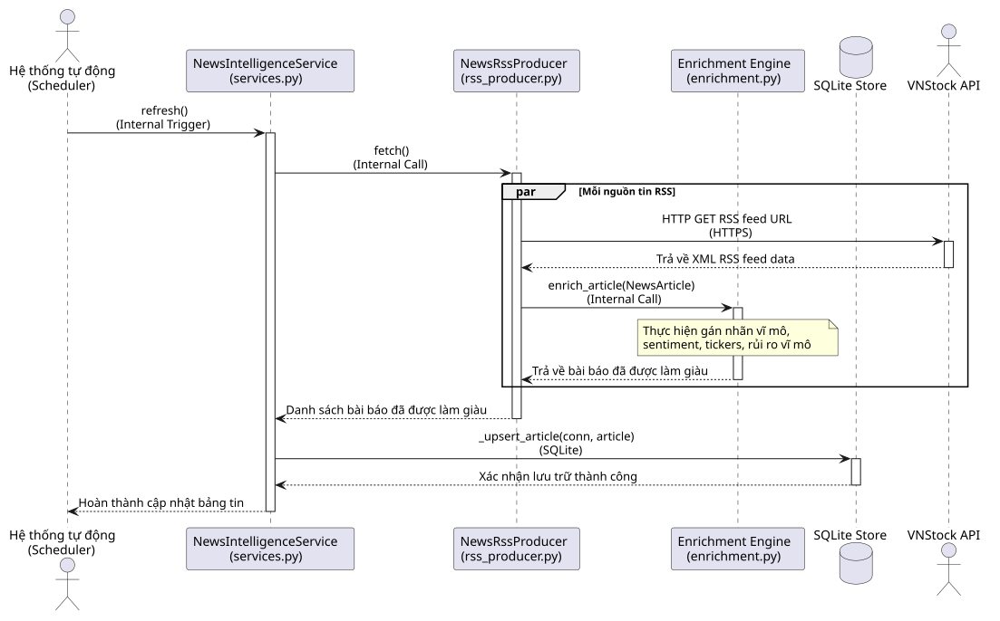

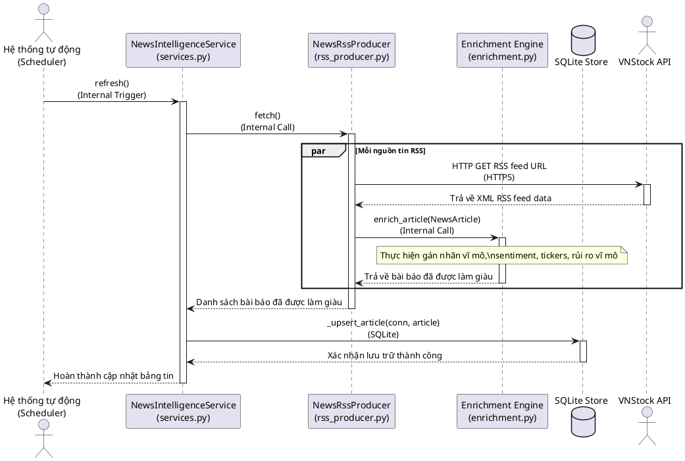

---

### 3. Tính điểm ưu tiên tin tức (UC_CalcImportance)

#### Mô tả
Chấm điểm tầm quan trọng của từng bài báo trên thang điểm 0-100 dựa trên phân tích từ khóa, nguồn tin và thời gian đăng tải, sau đó phân loại mức độ ưu tiên để hiển thị cho Học sinh/sinh viên.

#### Actors
- Primary: Hệ thống tự động (Hoạt động ngầm)

#### Pre-conditions
- Nhận thông tin bài viết thô cần được phân loại và chấm điểm từ luồng xử lý `enrich_article` của ca sử dụng UC_AnalyzeNews.

#### Main Flow
1. Bộ xử lý tính toán tuổi của bài viết dựa trên mốc thời gian hiện tại (`age_minutes`).
2. Tính toán điểm thành phần Tác động thị trường (Market Impact) dựa trên sự hiện diện của bộ từ khóa vĩ mô.
3. Tính toán điểm Độ tin cậy của nguồn (Source Reliability) dựa trên phân cấp nguồn tin (Tier 1-3+).
4. Tính toán điểm Độ tươi mới (Freshness), Độ độc quyền/mới lạ (Novelty), Mức độ nghiêm trọng (Severity), và Độ phủ (Breadth).
5. Áp dụng công thức trọng số để tính điểm số tổng thể (0-100).
6. Phân loại bài viết thành 5 nhãn: Critical, High, Medium, Low, Noise.

#### Post-conditions
- Trả về kết quả `ImportanceResult` gồm điểm số và nhãn ưu tiên để lưu trữ vào cơ sở dữ liệu.

#### Sequence Diagram
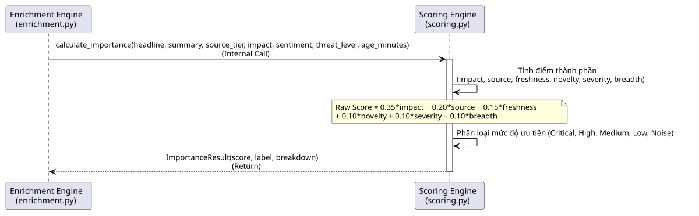

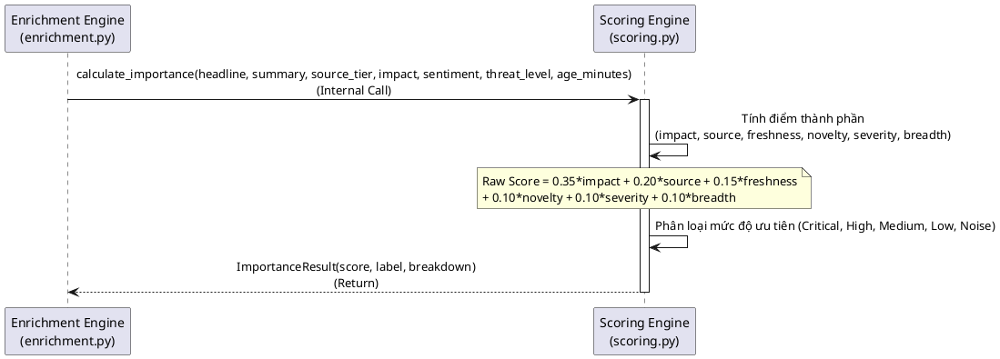

---

### 4. Tạo báo cáo EOD tự động (UC_EODReport)

#### Mô tả
Định kỳ chạy quy trình xử lý dữ liệu cuối ngày để đào tạo lại mô hình lượng hóa, dự báo rủi ro biến động, và sử dụng hệ thống tự động để viết báo cáo nhận định thị trường tự động gửi đến người dùng.

#### Actors
- Primary: Hệ thống tự động (Automated)
- Secondary: LLM Provider (External System)

#### Pre-conditions
- Đến thời gian chạy EOD cuối ngày hoặc nhận yêu cầu kích hoạt chạy EOD thủ công (`POST /eod/run`).

#### Main Flow
1. Hệ thống tự động gọi API khởi động luồng chạy EOD.
2. Dịch vụ EOD tải dữ liệu lịch sử giá và vĩ mô từ cache lưu trữ.
3. Kích hoạt ca sử dụng `Chạy mô hình dự báo XGBoost` (UC_RunXGBoost) để đào tạo và cập nhật xác suất lượng hóa.
4. Tính toán mức rủi ro Value-at-Risk (VaR) qua `var_engine` định lượng.
5. Gửi các chỉ số rủi ro đã tổng hợp sang Multi-Agent Orchestrator.
6. Trợ lý Agent gọi OpenAI API (LLM) để viết báo cáo nhận định EOD tự động.
7. Lưu trữ toàn bộ kết quả tính toán và báo cáo văn bản vào SQLite DB.

#### Post-conditions
- Báo cáo EOD được tạo thành công và lưu trữ phục vụ các yêu cầu hiển thị dashboard.

#### Sequence Diagram
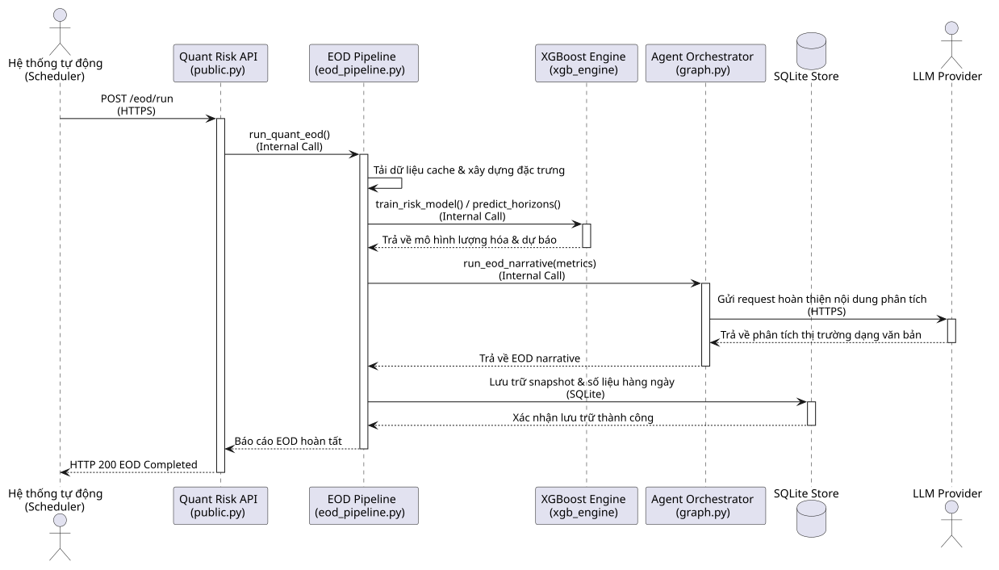

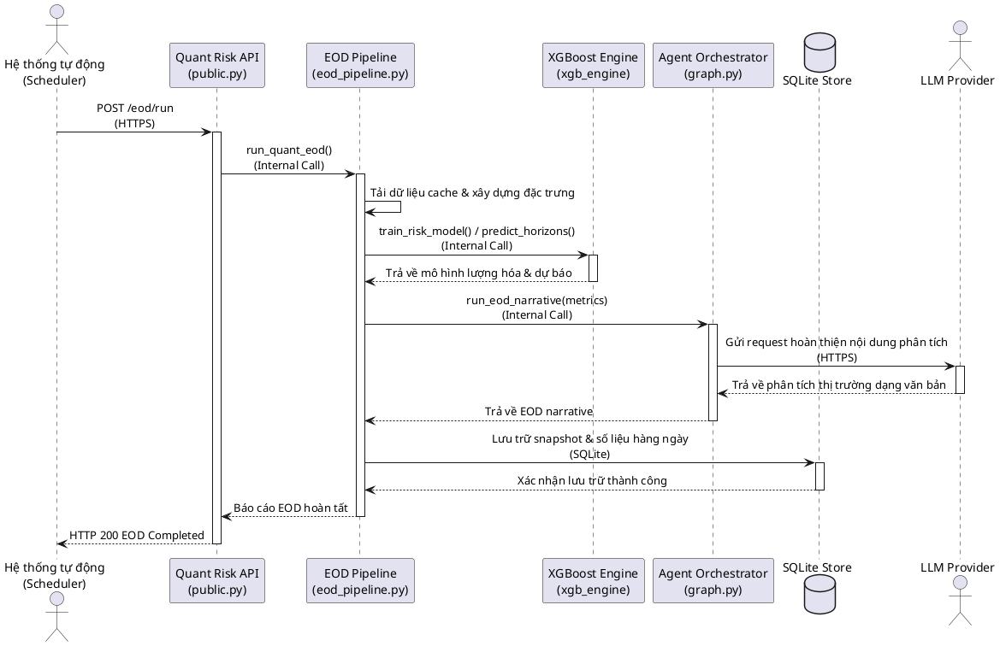

---

### 5. Chạy mô hình dự báo XGBoost (UC_RunXGBoost)

#### Mô tả
Huấn luyện mô hình phân loại Gradient Boosting trên dữ liệu thị trường vĩ mô lịch sử và đưa ra dự đoán xác suất sụt giảm thị trường qua các kỳ hạn.

#### Actors
- Primary: Hệ thống tự động (Hoạt động ngầm)

#### Pre-conditions
- Dữ liệu bảng (data panel) được tích lũy đầy đủ và làm sạch, chứa đầy đủ các cột đặc trưng kỹ thuật và chỉ số kinh tế vĩ mô.

#### Main Flow
1. Bộ huấn luyện tải ma trận dữ liệu lịch sử từ bộ nhớ cache SQLite.
2. Gán nhãn mục tiêu dựa trên biến động giá tương lai theo specs kỳ hạn (`1w`, `2w`, `1m`).
3. Huấn luyện thuật toán phân loại `HistGradientBoostingClassifier` cho từng kỳ hạn độc lập.
4. Thực hiện cân chỉnh xác suất (Probability Calibration) bằng `IsotonicRegression` để tối ưu hóa dự báo.
5. Tạo đối tượng mô hình mới `TrainedRiskModel` chứa cấu hình trọng số và bộ đặc trưng.

#### Post-conditions
- Trả về đối tượng mô hình mới đã được đào tạo và cân chỉnh để lưu trữ hoặc phục vụ dự báo trực tiếp.

#### Sequence Diagram
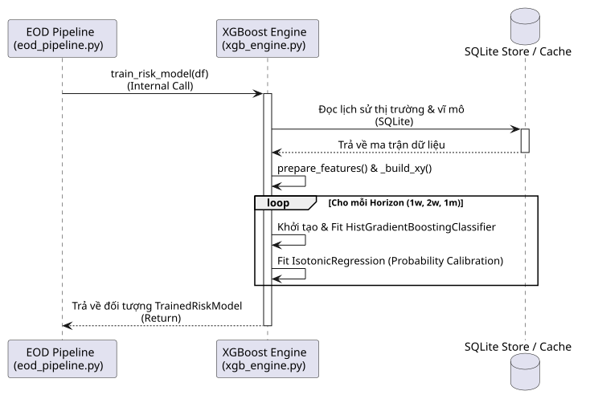

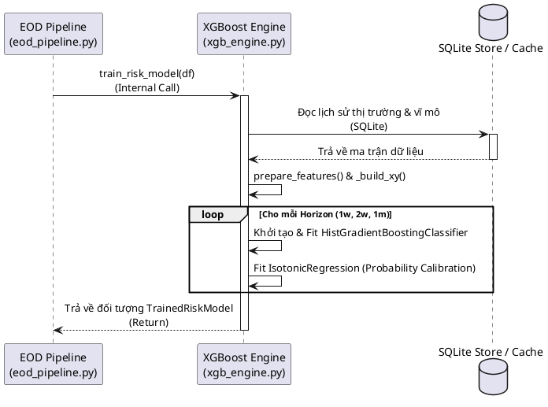

---

### 6. Quản lý danh mục theo dõi (UC_Watchlist)

#### Mô tả
Cho phép Học sinh/sinh viên quản lý danh mục cổ phiếu quan tâm, đồng bộ giá trực tiếp và yêu cầu trợ lý AI nhận xét đánh giá phân bổ danh mục.

#### Actors
- Primary: Học sinh/sinh viên
- Secondary: LLM Provider (External System)

#### Pre-conditions
- Học sinh/sinh viên đã đăng nhập và đang xem trang Watchlist cá nhân.

#### Main Flow
1. Học sinh/sinh viên chọn và thêm mã cổ phiếu muốn theo dõi.
2. Giao diện Web SPA gửi yêu cầu thêm mã (`POST /watchlist/items`).
3. Backend ghi nhận và đồng bộ dữ liệu giá cổ phiếu từ các nguồn cấp.
4. Người dùng yêu cầu nhận xét danh mục, Web SPA gửi yêu cầu `/watchlist/review`.
5. Backend gọi Agent Orchestration để tổng hợp chỉ số danh mục và gọi OpenAI API đánh giá.
6. Trả về nhận xét lượng hóa chi tiết và hiển thị lên giao diện cho Học sinh/sinh viên.

#### Post-conditions
- Danh sách watchlist được cập nhật và Học sinh/sinh viên nhận được phản hồi nhận xét phân bổ danh mục từ AI.

#### Sequence Diagram
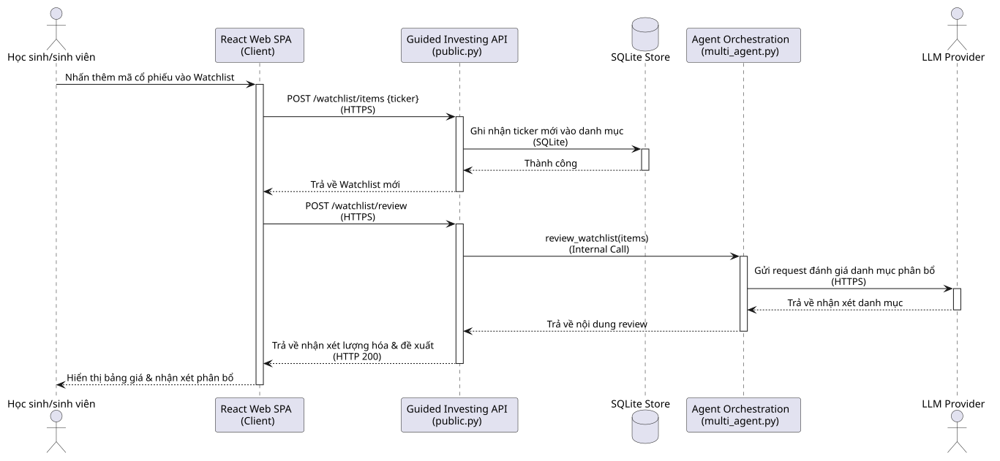

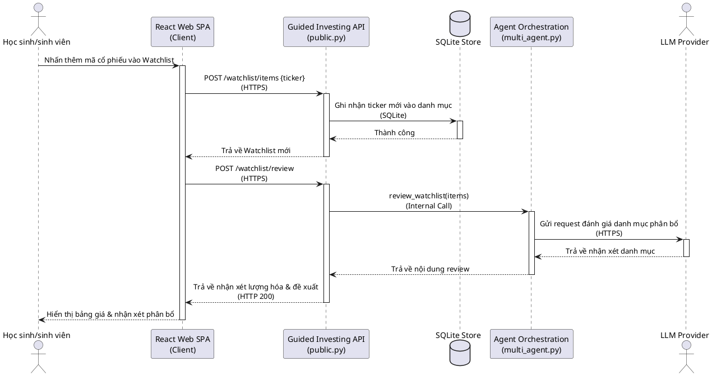

---

### 7. Tương tác trợ lý AI (UC_AIChat)

#### Mô tả
Cho phép Học sinh/sinh viên truy vấn thông tin thị trường, hỏi đáp rủi ro, và nhận phản hồi phân tích tài chính có kiểm duyệt từ trợ lý AI hoặc Coach.

#### Actors
- Primary: Học sinh/sinh viên
- Secondary: LLM Provider (External System)

#### Pre-conditions
- Học sinh/sinh viên nhập nội dung câu hỏi trong khung chat và nhấn gửi.

#### Main Flow
1. Web SPA gửi câu hỏi của người dùng tới API trợ lý AI (`POST /respond`).
2. Bộ kiểm duyệt Safety Policy kiểm tra tính an toàn của nội dung câu hỏi.
3. Nếu an toàn, tải thông tin ngữ cảnh vĩ mô và chỉ số rủi ro EOD mới nhất từ SQLite DB.
4. Gửi yêu cầu phân tích kèm ngữ cảnh tới Agent Orchestrator.
5. Agent tổng hợp và gọi OpenAI API thực hiện hoàn thiện câu trả lời.
6. Reviewer Agent kiểm duyệt chéo câu trả lời để tránh lỗi hallucination hoặc thông tin sai lệch.
7. Trả về câu trả lời định dạng Markdown cho Client Web SPA hiển thị.

#### Alternative Flows
- Nếu nội dung câu hỏi vi phạm chính sách an toàn (chứa từ khóa nhạy cảm hoặc độc hại), hệ thống chặn xử lý và trả về phản hồi cảnh báo an toàn chuẩn hóa mà không gọi LLM.

#### Post-conditions
- Học sinh/sinh viên nhận được câu trả lời chi tiết và an toàn từ trợ lý AI.

#### Sequence Diagram
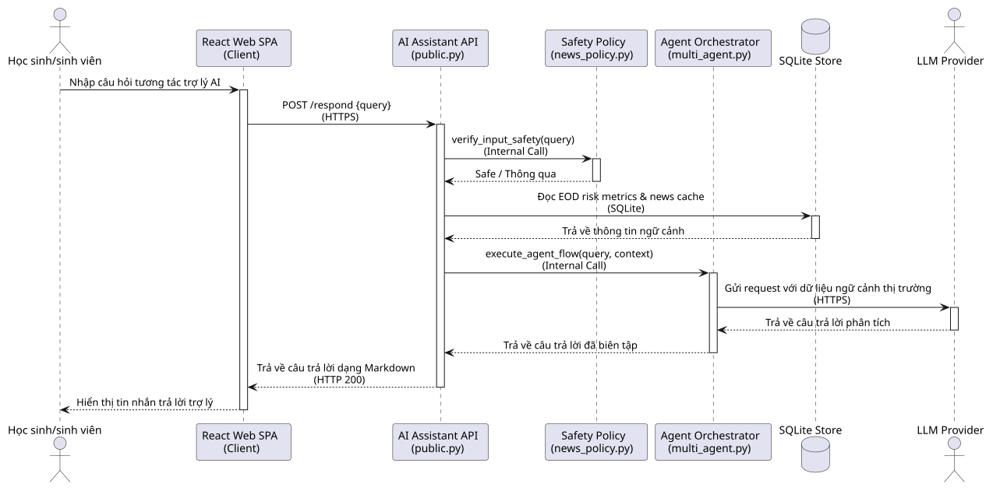

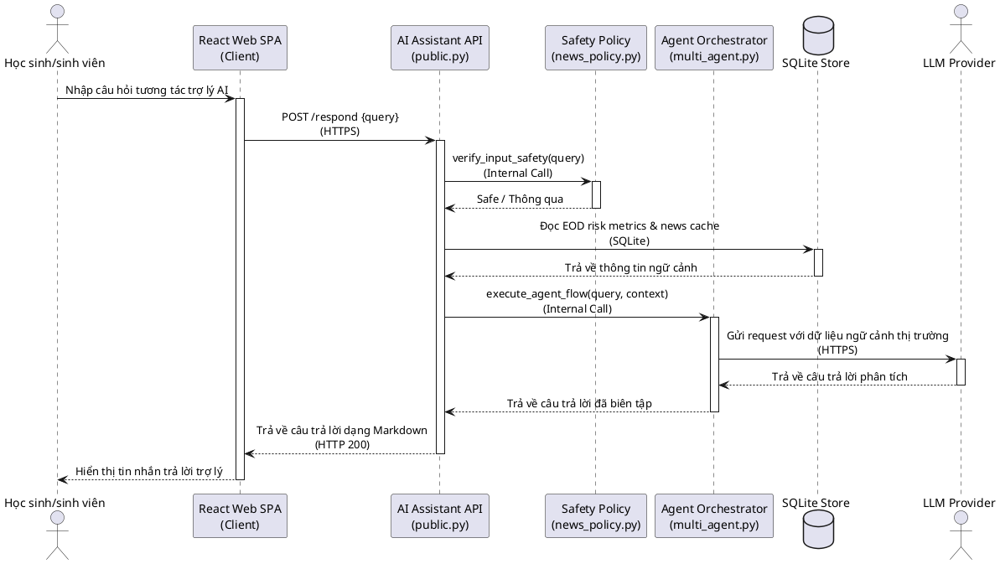

---

### 8. Chạy kịch bản Stress-test (UC_StressTest)

#### Mô tả
Cho phép Học sinh/sinh viên giả lập các thay đổi trong các biến số kinh tế vĩ mô (lãi suất, tỷ giá) để tính toán lại các chỉ số rủi ro dự báo, so sánh với kịch bản cơ sở.

#### Actors
- Primary: Học sinh/sinh viên

#### Pre-conditions
- Học sinh/sinh viên đang ở màn hình hiển thị rủi ro vĩ mô của hệ thống.

#### Main Flow
1. Học sinh/sinh viên thay đổi giá trị giả định của các biến số vĩ mô trên thanh trượt hoặc ô nhập liệu.
2. Web SPA gửi yêu cầu chạy kịch bản giả lập (`POST /scenario/rerun`).
3. Backend Quant Risk API gọi hàm `rerun_with_macro_override` của công cụ lượng hóa.
4. Động cơ lượng hóa sao chép hàng đặc trưng hiện tại và ghi đè các tham số giả định.
5. Gọi `predict_horizons` trên mô hình XGBoost đang kích hoạt với dữ liệu đã ghi đè.
6. Tính toán lại điểm số quyết định rủi ro giả định mới.
7. Trả về JSON so sánh giữa kịch bản cơ sở (Baseline) và kịch bản căng thẳng (Stress-tested).
8. Web SPA hiển thị biểu đồ so sánh chồng lấp.

#### Post-conditions
- Chỉ số rủi ro giả lập được tính toán và so sánh trực quan cho Học sinh/sinh viên.

#### Sequence Diagram
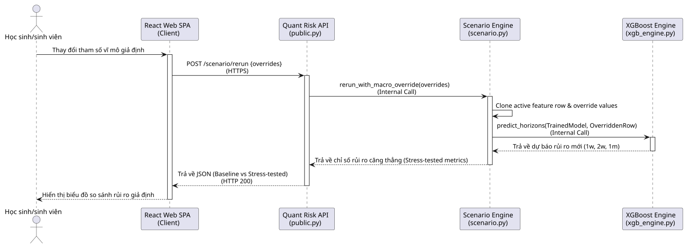

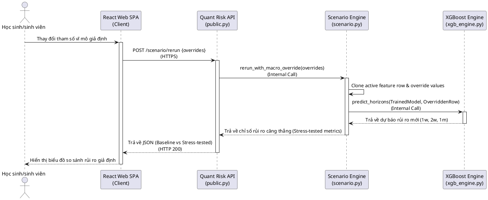

---

## Phụ lục

### A. Use Case Diagram tổng quan

Dưới đây là sơ đồ ca sử dụng tổng quan của toàn bộ hệ thống biểu diễn các quan hệ ranh giới và liên kết tác nhân:

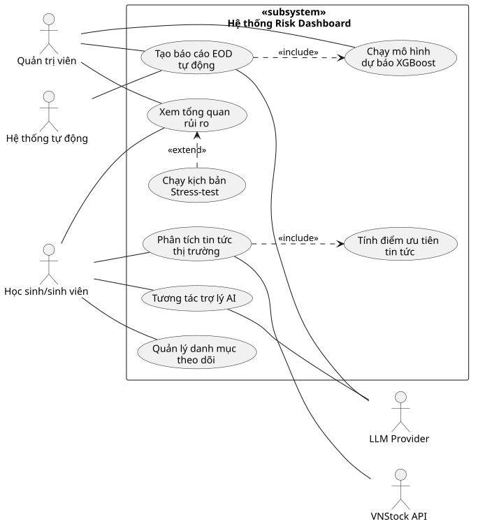

### B. Glossary

- **XGBoost (Extreme Gradient Boosting)**: Thuật toán học máy dựa trên cây quyết định được sử dụng để phân loại và dự đoán xác suất sụt giảm thị trường.
- **Value-at-Risk (VaR)**: Chỉ số lượng hóa rủi ro đo lường mức độ thua lỗ tối đa có thể xảy ra trong một khoảng thời gian xác định ở mức độ tin cậy cho trước.
- **EOD (End of Day)**: Quy trình xử lý dữ liệu hàng ngày được kích hoạt tự động vào cuối ngày để cập nhật các chỉ số lượng hóa.
- **LangGraph**: Thư viện dùng để xây dựng các luồng điều phối tác vụ tác nhân AI (Agent Orchestration) có trạng thái và có điều kiện rẽ nhánh.
- **Isotonic Regression**: Thuật toán cân chỉnh xác suất (Probability Calibration) được áp dụng sau mô hình phân loại để đảm bảo xác suất dự đoán khớp với tần suất thực tế.
