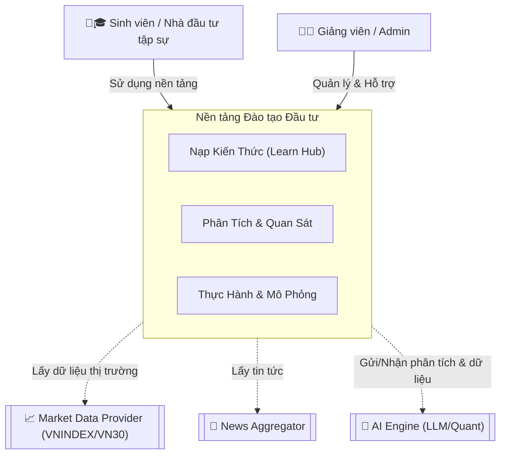

# Lớp 1: Sơ đồ Ngữ cảnh Hệ thống (System Context Diagram)

## Mục đích
Sơ đồ Ngữ cảnh Hệ thống (System Context Diagram) cung cấp cái nhìn tổng quan nhất về Nền tảng Đào tạo Đầu tư. Sơ đồ này thể hiện ranh giới của hệ thống, các đối tượng (Actors) tương tác trực tiếp với hệ thống và các hệ thống bên ngoài có liên quan. Nó giúp các bên liên quan hiểu rõ hệ thống đang xây dựng tương tác với ai và cần tích hợp với những nguồn dữ liệu/dịch vụ nào.

---

## Sơ đồ

> [!NOTE]
> Hệ thống đóng vai trò cầu nối, chuyển hóa dữ liệu tài chính phức tạp từ các nguồn bên ngoài thành nội dung giáo dục và môi trường thực hành an toàn cho người dùng.

---

## Các Đối tượng (Actors) và Hệ thống Bên ngoài

### 1. Primary Actor
- **🧑🎓 Sinh viên / Nhà đầu tư tập sự (Student/Trainee):** Người dùng chính của hệ thống. Họ truy cập để học tập kiến thức đầu tư, sử dụng các công cụ phân tích để thực hành đọc hiểu thị trường/báo cáo tài chính, và tham gia giao dịch ảo để rèn luyện kỹ năng mà không chịu rủi ro mất tiền thật.

### 2. Support Actor
- **👨🏫 Giảng viên / Admin (Instructor/Admin):** Người quản lý nội dung học tập, theo dõi tiến độ của sinh viên, chấm điểm (nếu có), quản lý các kịch bản thực hành (backtest) và cấu hình hệ thống.

### 3. External Systems
- **📈 Market Data Provider (VNINDEX/VN30):** Nguồn cung cấp dữ liệu thị trường chứng khoán Việt Nam (giá cổ phiếu, khối lượng giao dịch, chỉ số VNINDEX, VN30, v.v.) theo thời gian thực hoặc độ trễ thấp.
- **📰 News Aggregator:** Hệ thống tổng hợp tin tức tài chính, kinh tế từ các nguồn báo chí uy tín.
- **🧠 AI Engine (LLM/Quant):** Hệ thống trí tuệ nhân tạo hỗ trợ phân tích tin tức, phân tích báo cáo tài chính, đề xuất lộ trình học tập, hoặc đánh giá kịch bản giao dịch.

---

## Bảng Tóm tắt Vai trò

| Đối tượng / Hệ thống | Loại | Vai trò / Trách nhiệm chính |
| :--- | :--- | :--- |
| **Sinh viên / NĐT tập sự** | Primary Actor | Học tập, phân tích, thực hành giao dịch ảo và nhận phản hồi giáo dục. |
| **Giảng viên / Admin** | Support Actor | Quản trị hệ thống, nội dung bài giảng, và hỗ trợ quá trình học tập của sinh viên. |
| **Market Data Provider** | External System | Cung cấp dữ liệu thị trường và báo cáo tài chính. |
| **News Aggregator** | External System | Cung cấp luồng tin tức tài chính liên tục. |
| **AI Engine** | External System | Xử lý dữ liệu ngôn ngữ tự nhiên, phân tích sentiment, và hỗ trợ phân tích lượng (Quant). |
