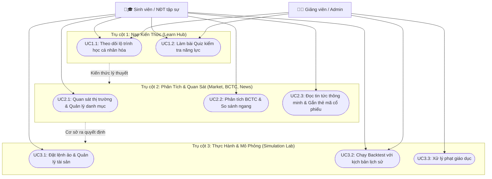

# Lớp 2: Sơ đồ Use Case Tổng quan (High-Level Use Case Diagram)

## Mục đích
Sơ đồ Use Case Tổng quan gom nhóm 5 module chức năng của hệ thống thành 3 trụ cột giá trị (Value Pillars). Điều này giúp khách hàng và đội ngũ phát triển dễ dàng hình dung Hành trình Người dùng (User Journey) từ lúc bắt đầu tiếp thu kiến thức, đến việc quan sát phân tích thực tế, và cuối cùng là thực hành giao dịch mô phỏng.

---

## Sơ đồ

> [!NOTE]
> Hành trình người dùng đi theo logic: **Học (Pillar 1) -> Phân tích (Pillar 2) -> Thực hành (Pillar 3)**. Tuy nhiên, người dùng có thể tự do di chuyển qua lại giữa các trụ cột dựa trên nhu cầu thực tế.

---

## Mô tả Chi tiết các Use Case

### Trụ cột 1: Nạp Kiến Thức (Learn Hub)
- **UC1.1 - Theo dõi lộ trình học cá nhân hóa:** Sinh viên có thể xem các khóa học, bài giảng video/text được sắp xếp theo cấp độ (người mới, trung cấp, nâng cao). Hệ thống tự động đề xuất lộ trình dựa trên mục tiêu học tập.
- **UC1.2 - Làm bài Quiz kiểm tra năng lực:** Sau mỗi bài học hoặc module, sinh viên thực hiện các bài trắc nghiệm để củng cố kiến thức và mở khóa các module tiếp theo.

### Trụ cột 2: Phân Tích & Quan Sát (Market, BCTC, News)
- **UC2.1 - Quan sát thị trường & Quản lý danh mục (Watchlist):** Cung cấp biểu đồ giá, bảng điện chứng khoán theo thời gian thực. Sinh viên tạo danh sách theo dõi các mã cổ phiếu yêu thích.
- **UC2.2 - Phân tích BCTC & So sánh ngang:** Xem báo cáo tài chính (Bảng CĐKT, KQKD, LCTT) được trực quan hóa bằng biểu đồ. Cho phép so sánh các chỉ số tài chính (P/E, ROE...) giữa các công ty trong cùng ngành.
- **UC2.3 - Đọc tin tức thông minh & Gắn thẻ mã cổ phiếu:** Luồng tin tức thị trường được cập nhật liên tục, AI tự động nhận diện và gắn thẻ (tag) các mã cổ phiếu liên quan trong bài viết, kèm theo đánh giá cảm xúc (tích cực/tiêu cực).

### Trụ cột 3: Thực Hành & Mô Phỏng (Simulation Lab)
- **UC3.1 - Đặt lệnh ảo & Quản lý tài sản:** Cung cấp tài khoản ảo với số tiền giả định. Sinh viên thực hiện mua/bán cổ phiếu dựa trên dữ liệu thật của thị trường, theo dõi lời/lỗ (PnL).
- **UC3.2 - Chạy Backtest với kịch bản lịch sử:** Sinh viên áp dụng kiến thức để chạy thử nghiệm các chiến lược giao dịch trên dữ liệu giá trong quá khứ nhằm kiểm chứng tính hiệu quả.
- **UC3.3 - Xử lý phạt giáo dục:** Khi sinh viên vi phạm các nguyên tắc quản trị rủi ro cơ bản (như all-in một cổ phiếu rủi ro), hệ thống đưa ra các hình phạt mang tính giáo dục (khóa lệnh tạm thời, yêu cầu học lại bài quản trị vốn).

---

## Bảng Ánh xạ Use Case vào Module & Trụ cột

| Mã UC | Tên Use Case | Module | Trụ cột (Pillar) |
| :--- | :--- | :--- | :--- |
| **UC1.1** | Theo dõi lộ trình học cá nhân hóa | Learn Hub | 1 - Nạp Kiến Thức |
| **UC1.2** | Làm bài Quiz kiểm tra năng lực | Learn Hub | 1 - Nạp Kiến Thức |
| **UC2.1** | Quan sát thị trường & Quản lý danh mục | Market Data | 2 - Phân Tích & Quan Sát |
| **UC2.2** | Phân tích BCTC & So sánh ngang | Financial Analysis | 2 - Phân Tích & Quan Sát |
| **UC2.3** | Đọc tin tức thông minh & Gắn thẻ mã cổ phiếu | News | 2 - Phân Tích & Quan Sát |
| **UC3.1** | Đặt lệnh ảo & Quản lý tài sản | Simulation Lab | 3 - Thực Hành & Mô Phỏng |
| **UC3.2** | Chạy Backtest với kịch bản lịch sử | Simulation Lab | 3 - Thực Hành & Mô Phỏng |
| **UC3.3** | Xử lý phạt giáo dục | Simulation Lab | 3 - Thực Hành & Mô Phỏng |
