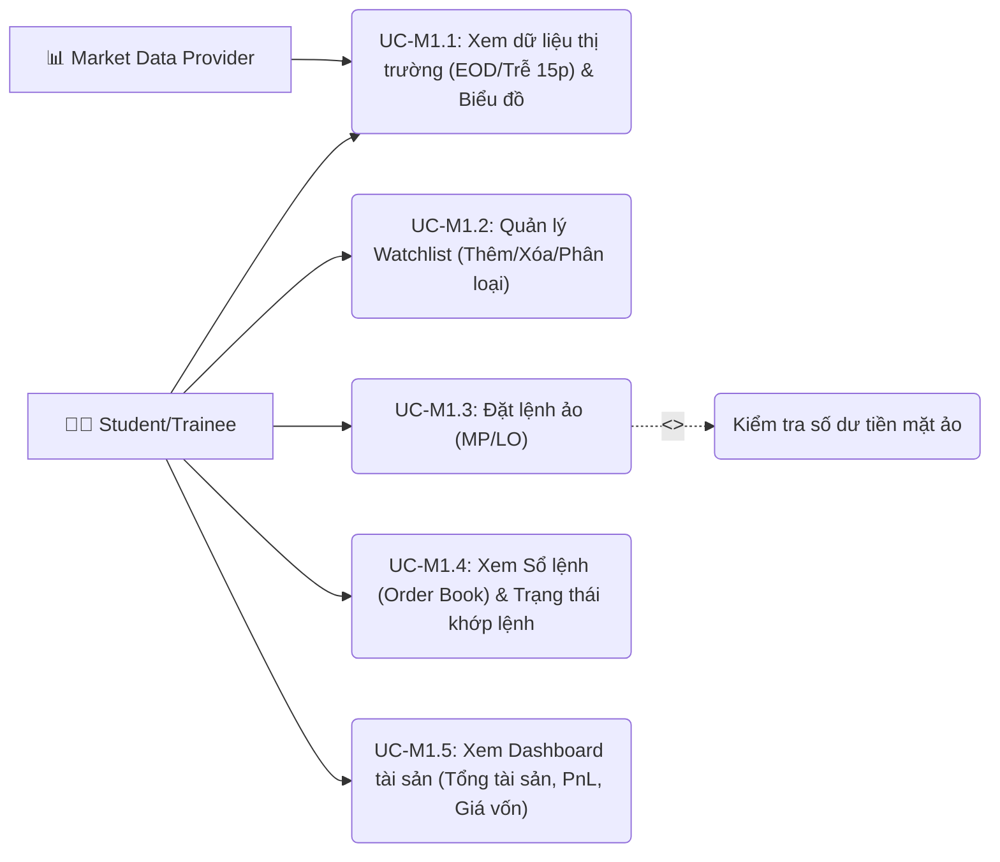
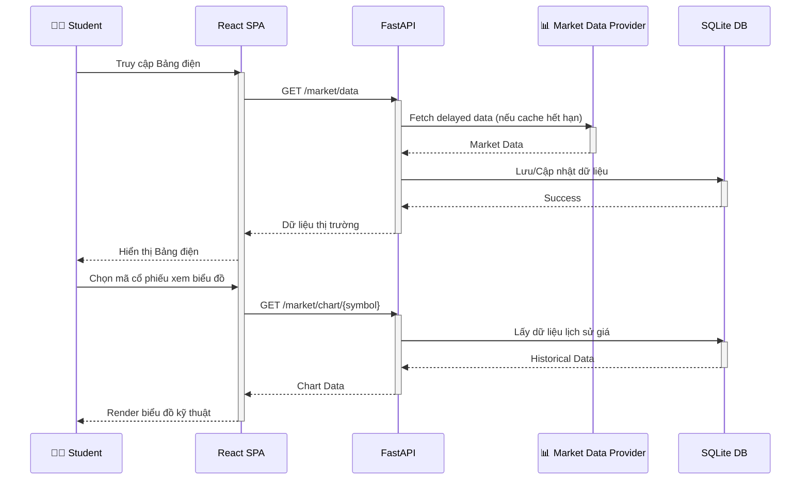
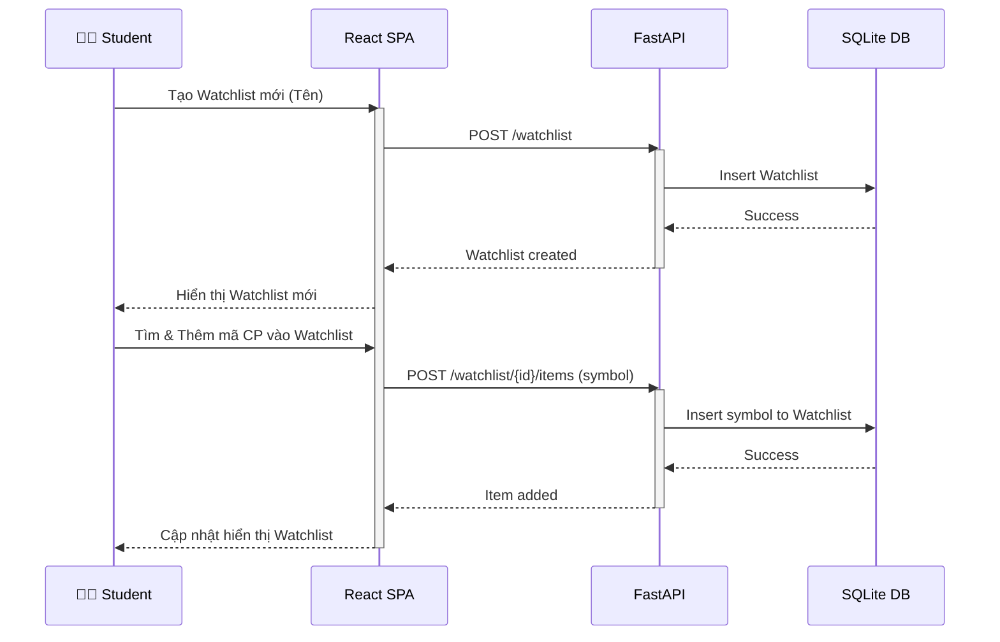
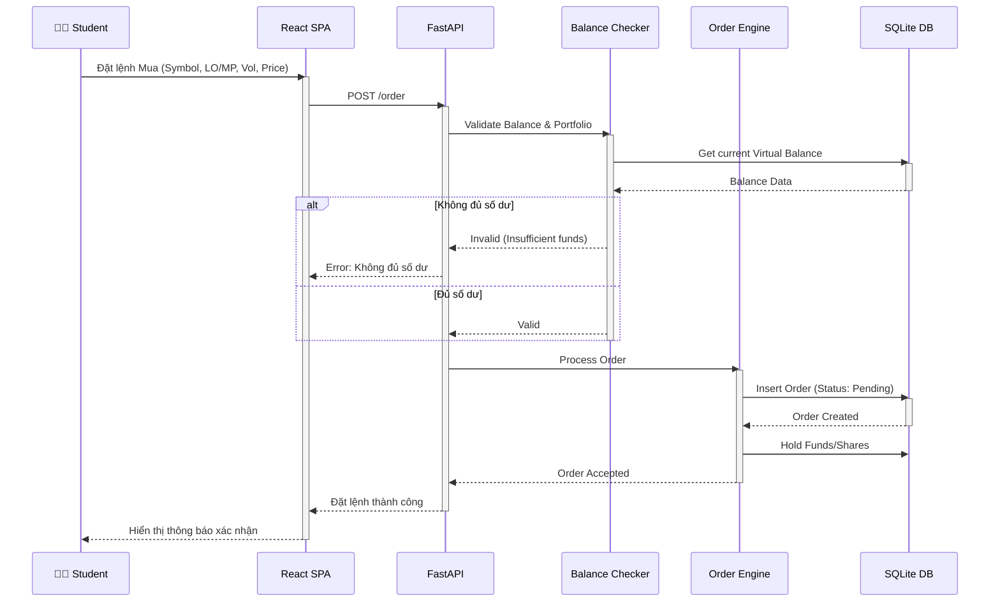
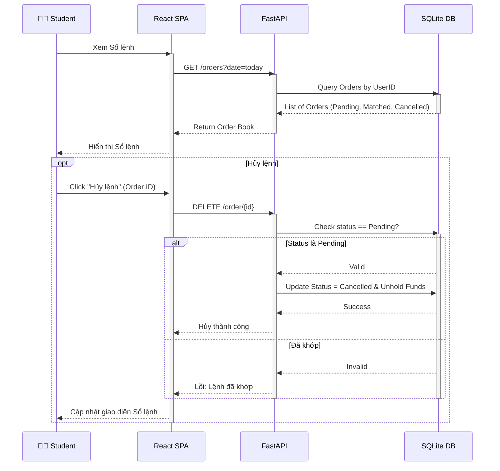
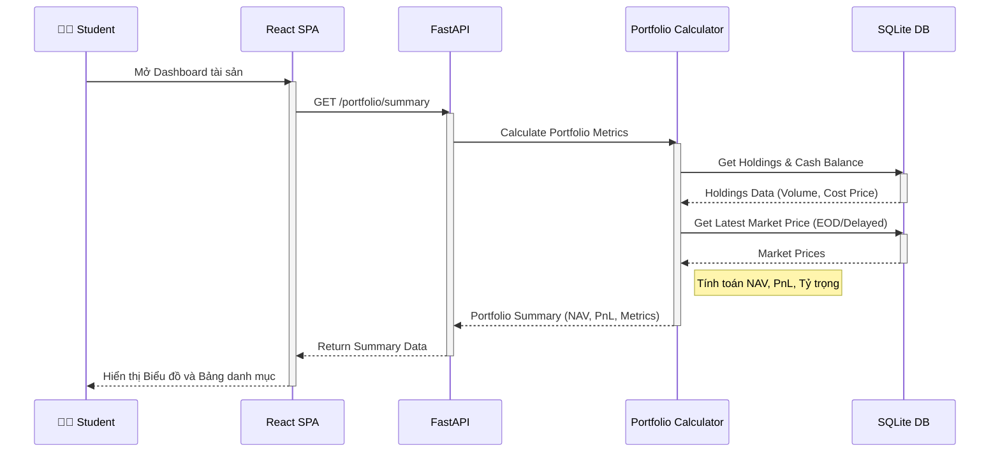

# Lớp 3 - Module 1: Bảng Điện & Quản Lý Danh Mục

## Use Case Diagram

---

## UC-M1.1: Xem dữ liệu thị trường (EOD/Trễ 15p) & Biểu đồ

### 1. Mô tả
Cho phép Học viên xem dữ liệu thị trường chứng khoán (giá, khối lượng, các chỉ số) với độ trễ 15 phút hoặc dữ liệu cuối ngày (EOD), cùng với biểu đồ giá kỹ thuật để phân tích.

### 2. Actors
- **Primary:** 🧑‍🎓 Student/Trainee
- **Secondary:** 📊 Market Data Provider

### 3. Điều kiện trước (Pre-condition)
- Học viên đã đăng nhập thành công vào nền tảng.
- Hệ thống kết nối ổn định với Market Data Provider.

### 4. Luồng chính (Main Flow)
1. Học viên truy cập vào tính năng Bảng Điện / Thị trường.
2. Hệ thống React SPA gửi yêu cầu lấy dữ liệu thị trường đến FastAPI backend.
3. Backend lấy dữ liệu mới nhất (đã được cache hoặc fetch từ Market Data Provider qua DB).
4. Backend trả về dữ liệu và SPA hiển thị Bảng điện.
5. Học viên chọn một mã chứng khoán để xem biểu đồ chi tiết.
6. Backend trả về dữ liệu lịch sử và SPA render biểu đồ (ví dụ: TradingView chart).

### 5. Luồng thay thế (Alternative Flow)
- *Lỗi kết nối dữ liệu:* Nếu không kết nối được với Market Data Provider, hệ thống hiển thị dữ liệu lưu trữ gần nhất và thông báo cho người dùng "Dữ liệu đang bị trễ hoặc mất kết nối".

### 6. Điều kiện sau (Post-condition)
Học viên xem được dữ liệu thị trường và biểu đồ tương ứng.

### 7. Quy tắc nghiệp vụ (Business Rules)
> [!IMPORTANT]
> Dữ liệu thị trường cung cấp cho tài khoản học viên mặc định là dữ liệu trễ 15 phút hoặc dữ liệu EOD (End Of Day) tùy theo cấu hình cấp phép, không phải Real-time để tiết kiệm chi phí API.

### 8. Sequence Diagram

---

## UC-M1.2: Quản lý Watchlist (Thêm/Xóa/Phân loại)

### 1. Mô tả
Học viên có thể tạo và quản lý nhiều danh sách theo dõi (Watchlist) để tiện theo dõi các mã cổ phiếu quan tâm theo các tiêu chí hoặc danh mục riêng.

### 2. Actors
- **Primary:** 🧑‍🎓 Student/Trainee

### 3. Điều kiện trước (Pre-condition)
- Học viên đã đăng nhập.

### 4. Luồng chính (Main Flow)
1. Học viên chọn "Tạo Watchlist mới" và nhập tên.
2. Học viên tìm kiếm mã cổ phiếu và chọn "Thêm vào Watchlist".
3. SPA gửi API request lên Backend.
4. Backend lưu thông tin vào CSDL.
5. SPA cập nhật và hiển thị danh sách mã cổ phiếu trong Watchlist vừa chọn.
6. Học viên có thể xóa mã khỏi Watchlist hoặc chuyển sang danh mục khác.

### 5. Luồng thay thế (Alternative Flow)
- *Mã cổ phiếu không tồn tại:* Hệ thống báo lỗi và không cho phép thêm.

### 6. Điều kiện sau (Post-condition)
Watchlist được cập nhật (thêm, xóa, hoặc tạo mới) và lưu vào hồ sơ Học viên.

### 7. Quy tắc nghiệp vụ (Business Rules)
> [!IMPORTANT]
> Mỗi Học viên được tạo tối đa 5 Watchlist, mỗi Watchlist tối đa 50 mã cổ phiếu.

### 8. Sequence Diagram

---

## UC-M1.3: Đặt lệnh ảo (MP/LO)

### 1. Mô tả
Cho phép Học viên thực hành đặt lệnh mua/bán cổ phiếu bằng tiền ảo (Virtual Money). Hỗ trợ các loại lệnh cơ bản như Lệnh thị trường (MP) và Lệnh giới hạn (LO). Bao gồm tính năng kiểm tra số dư.

### 2. Actors
- **Primary:** 🧑‍🎓 Student/Trainee

### 3. Điều kiện trước (Pre-condition)
- Học viên đã đăng nhập.
- Học viên đã có tài khoản giao dịch ảo (Virtual Account) với số dư khởi tạo.

### 4. Luồng chính (Main Flow)
1. Học viên chọn mã cổ phiếu, chọn loại lệnh (Mua/Bán) và loại giá (MP/LO).
2. Học viên nhập khối lượng và giá (nếu là lệnh LO).
3. SPA gửi yêu cầu đặt lệnh lên API.
4. (Include) Backend gọi Balance Checker để kiểm tra số dư tiền mặt (đối với lệnh Mua) hoặc số dư cổ phiếu (đối với lệnh Bán).
5. Sau khi xác thực hợp lệ, Backend chuyển lệnh vào Order Engine.
6. Order Engine ghi nhận lệnh vào Database trạng thái "Pending" (Chờ khớp).
7. SPA thông báo đặt lệnh thành công.

### 5. Luồng thay thế (Alternative Flow)
- *Không đủ số dư:* Balance Checker trả về False. Backend từ chối lệnh và gửi thông báo lỗi "Không đủ số dư tiền/cổ phiếu".

### 6. Điều kiện sau (Post-condition)
Lệnh được ghi nhận vào sổ lệnh của hệ thống. Số tiền/cổ phiếu tương ứng có thể bị phong tỏa (hold).

### 7. Quy tắc nghiệp vụ (Business Rules)
> [!IMPORTANT]
> - Lệnh MP chỉ được đặt trong phiên khớp lệnh liên tục.
> - Số lượng đặt lệnh phải là bội số của 100 (theo quy định sàn HOSE hiện hành).

### 8. Sequence Diagram

---

## UC-M1.4: Xem Sổ lệnh (Order Book) & Trạng thái khớp lệnh

### 1. Mô tả
Học viên xem danh sách các lệnh đã đặt trong ngày hoặc trong quá khứ, cùng với trạng thái hiện tại của lệnh (Chờ khớp, Đã khớp, Đã hủy).

### 2. Actors
- **Primary:** 🧑‍🎓 Student/Trainee

### 3. Điều kiện trước (Pre-condition)
- Học viên đã đăng nhập.

### 4. Luồng chính (Main Flow)
1. Học viên truy cập tab "Sổ lệnh".
2. SPA yêu cầu API lấy danh sách lệnh của tài khoản.
3. Backend truy vấn DB lấy thông tin lịch sử lệnh và trạng thái mới nhất.
4. SPA hiển thị danh sách lệnh.
5. Học viên có thể sử dụng bộ lọc để xem theo ngày, trạng thái hoặc mã chứng khoán.

### 5. Luồng thay thế (Alternative Flow)
- *Học viên yêu cầu hủy lệnh:* Nếu lệnh đang ở trạng thái "Pending", Học viên có thể chọn Hủy. Backend cập nhật trạng thái thành "Cancelled" và giải tỏa số dư.

### 6. Điều kiện sau (Post-condition)
Học viên nắm được tình trạng các lệnh giao dịch của mình.

### 7. Quy tắc nghiệp vụ (Business Rules)
> [!IMPORTANT]
> Chỉ được phép hủy các lệnh chưa khớp (Pending). Lệnh đã khớp (Matched) một phần hoặc toàn bộ không thể bị hủy.

### 8. Sequence Diagram

---

## UC-M1.5: Xem Dashboard tài sản (Tổng tài sản, PnL, Giá vốn)

### 1. Mô tả
Cung cấp cái nhìn tổng quan về danh mục đầu tư hiện tại của Học viên. Hiển thị Tổng tài sản (NAV), Lợi nhuận/Thua lỗ (PnL - Lãi/lỗ dự kiến), Giá vốn trung bình của các mã cổ phiếu đang nắm giữ, và tỷ trọng tiền mặt/cổ phiếu.

### 2. Actors
- **Primary:** 🧑‍🎓 Student/Trainee

### 3. Điều kiện trước (Pre-condition)
- Học viên đã đăng nhập và đang có tài sản (tiền mặt ảo hoặc cổ phiếu).

### 4. Luồng chính (Main Flow)
1. Học viên truy cập "Quản lý tài sản" / "Dashboard".
2. SPA gọi API yêu cầu thông tin Portfolio.
3. Backend gọi Portfolio Calculator.
4. Portfolio Calculator truy vấn số lượng cổ phiếu đang nắm giữ, giá vốn từ DB và giá thị trường hiện tại.
5. Tính toán NAV, PnL (chưa thực hiện) và các chỉ số liên quan.
6. Backend trả về kết quả cho SPA.
7. SPA render các biểu đồ tròn (phân bổ tài sản) và bảng chi tiết danh mục.

### 5. Luồng thay thế (Alternative Flow)
- Không có

### 6. Điều kiện sau (Post-condition)
Học viên xem được hiệu quả đầu tư của mình.

### 7. Quy tắc nghiệp vụ (Business Rules)
> [!IMPORTANT]
> - Giá trị tài sản ròng (NAV) = Tiền mặt + (Tổng số lượng cổ phiếu * Giá thị trường hiện tại).
> - PnL (%) = (Giá thị trường - Giá vốn trung bình) / Giá vốn trung bình * 100.

### 8. Sequence Diagram

