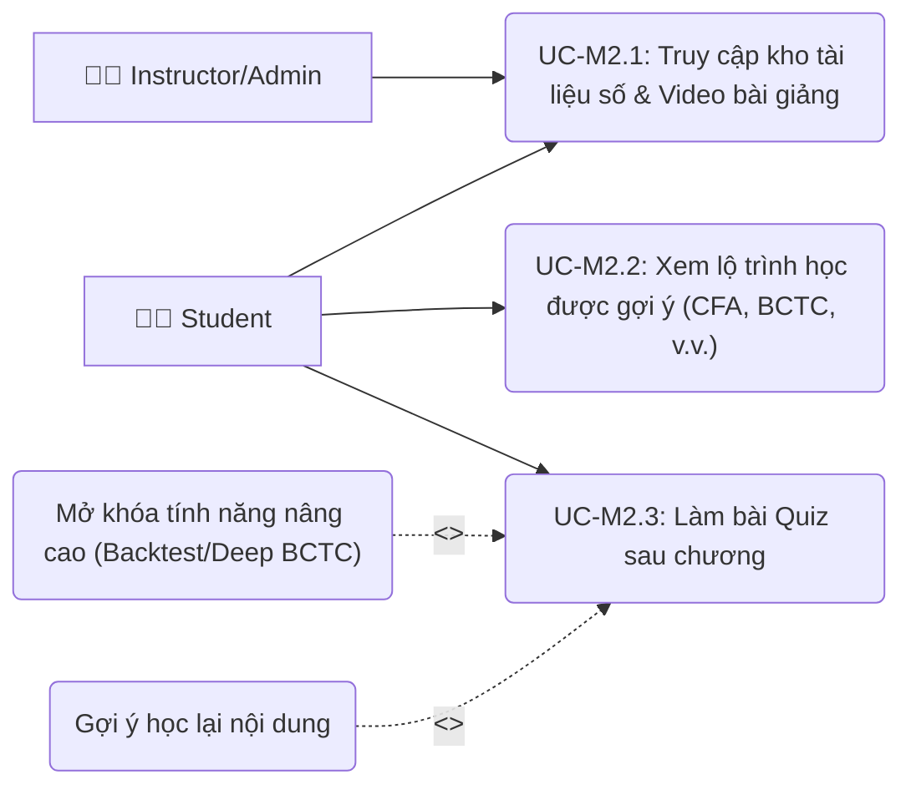
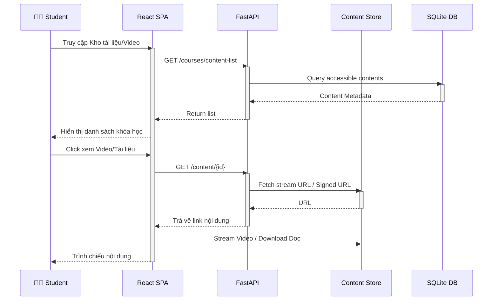
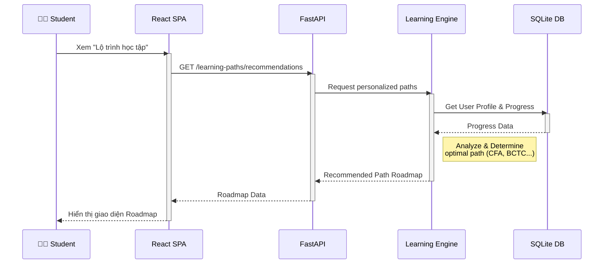
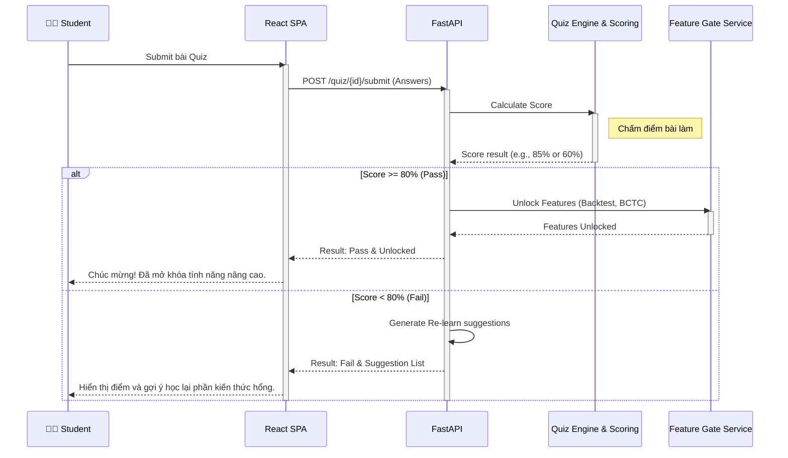

# Lớp 3 - Module 2: Learn Hub (Đào Tạo)

## Use Case Diagram

---

## UC-M2.1: Truy cập kho tài liệu số & Video bài giảng

### 1. Mô tả
Học viên truy cập vào nền tảng để xem hoặc tải xuống các tài liệu học tập, bao gồm PDF, slide bài giảng và xem các video hướng dẫn do Giảng viên/Admin cung cấp.

### 2. Actors
- **Primary:** 🧑‍🎓 Student
- **Secondary:** 👨‍🏫 Instructor/Admin (Người quản lý và upload nội dung)

### 3. Điều kiện trước (Pre-condition)
- Học viên đã đăng nhập vào nền tảng.
- Admin/Giảng viên đã upload tài liệu và video vào Content Store.

### 4. Luồng chính (Main Flow)
1. Học viên chọn mục "Khóa học" hoặc "Kho tài liệu".
2. SPA gọi API để lấy danh sách các khóa học, chương bài và tài liệu khả dụng.
3. Backend truy vấn cơ sở dữ liệu lấy danh sách Metadata của tài liệu.
4. SPA hiển thị danh sách cho Học viên.
5. Học viên chọn một video hoặc tài liệu để xem.
6. SPA fetch nội dung từ Content Store và stream video hoặc render PDF viewer.
7. Học viên hoàn thành việc xem/học.

### 5. Luồng thay thế (Alternative Flow)
- *Tài liệu bị khóa:* Học viên cố gắng truy cập bài học chưa được mở khóa (do chưa hoàn thành bài trước). Hệ thống báo lỗi và yêu cầu học theo thứ tự.

### 6. Điều kiện sau (Post-condition)
Trạng thái tiến độ học tập (Progress) của Học viên được cập nhật (ví dụ: đã xem 50% video).

### 7. Quy tắc nghiệp vụ (Business Rules)
> [!IMPORTANT]
> Nội dung học tập phải được phân quyền. Chỉ những tài liệu/video được đánh dấu "Public" hoặc thuộc khóa học mà user đã đăng ký/được phân bổ mới được phép truy cập.

### 8. Sequence Diagram

---

## UC-M2.2: Xem lộ trình học được gợi ý (CFA, BCTC, v.v.)

### 1. Mô tả
Hệ thống cung cấp các lộ trình học tập (Learning Paths) được cá nhân hóa hoặc theo chuẩn (như CFA level 1, Đọc hiểu Báo cáo tài chính, Phân tích kỹ thuật) để định hướng cho Học viên.

### 2. Actors
- **Primary:** 🧑‍🎓 Student

### 3. Điều kiện trước (Pre-condition)
- Học viên đã đăng nhập.
- Có thể Học viên đã thực hiện một bài đánh giá năng lực đầu vào.

### 4. Luồng chính (Main Flow)
1. Học viên vào trang "Lộ trình học tập".
2. SPA gửi yêu cầu lấy Lộ trình lên API.
3. Backend gọi Learning Engine để đánh giá profile và tiến độ của Học viên.
4. Learning Engine trả về danh sách các lộ trình phù hợp (Gợi ý).
5. SPA hiển thị dạng bản đồ hoặc tiến trình (roadmap) cho Học viên.
6. Học viên chọn một điểm trên roadmap để bắt đầu học.

### 5. Luồng thay thế (Alternative Flow)
- *Học viên mới:* Nếu là học viên mới chưa có dữ liệu, Learning Engine sẽ trả về lộ trình "Cơ bản cho người mới bắt đầu" (Beginner Path) làm mặc định.

### 6. Điều kiện sau (Post-condition)
Học viên hiểu được bước tiếp theo trong quá trình học của mình và được chuyển hướng đúng bài học.

### 7. Quy tắc nghiệp vụ (Business Rules)
> [!IMPORTANT]
> Lộ trình học tập là một chuỗi các modules phụ thuộc (Prerequisite). Học viên phải hoàn thành Node A mới được mở khóa Node B.

### 8. Sequence Diagram

---

## UC-M2.3: Làm bài Quiz sau chương

### 1. Mô tả
Sau khi hoàn thành một chương hoặc khóa học, Học viên phải làm bài trắc nghiệm (Quiz) để kiểm tra kiến thức. Dựa trên điểm số, hệ thống sẽ mở khóa các tính năng thực hành nâng cao trên hệ thống hoặc yêu cầu học lại.

### 2. Actors
- **Primary:** 🧑‍🎓 Student

### 3. Điều kiện trước (Pre-condition)
- Học viên đã hoàn thành tối thiểu 80% thời lượng của bài học/chương đó.

### 4. Luồng chính (Main Flow)
1. Học viên click "Bắt đầu làm bài Quiz".
2. SPA lấy bộ câu hỏi từ API và hiển thị cho Học viên.
3. Học viên chọn các đáp án và bấm Nộp bài (Submit).
4. API nhận câu trả lời và chuyển cho Quiz Engine.
5. Quiz Engine chấm điểm (Scoring Service).
6. Nếu điểm >= 80%:
   - Feature Gate Service mở khóa các tính năng nâng cao tương ứng (Ví dụ: Backtest, Phân tích BCTC chuyên sâu).
   - SPA chúc mừng Học viên.
7. Nếu điểm < 80%:
   - Hệ thống gợi ý Học viên ôn tập lại các phần trả lời sai.
   - SPA hiển thị các bài học cần học lại.

### 5. Luồng thay thế (Alternative Flow)
- *Hết thời gian:* Nếu bài Quiz có đếm giờ và hết giờ, hệ thống tự động nộp bài với các câu đã chọn.

### 6. Điều kiện sau (Post-condition)
Hồ sơ học tập của Học viên được lưu lại điểm số. Các quyền truy cập tính năng (Feature flags) của người dùng được cập nhật tương ứng.

### 7. Quy tắc nghiệp vụ (Business Rules)
> [!IMPORTANT]
> NGHIỆP VỤ CỐT LÕI (CRITICAL BUSINESS RULE):
> - **Điểm >= 80% (Pass):** Học viên được cấp chứng nhận vượt qua chương và hệ thống (Feature Gate) sẽ tự động mở khóa các công cụ thực hành chuyên sâu ở Module 3 & 4 (Backtest / Deep BCTC).
> - **Điểm < 80% (Fail):** Không mở khóa. Hệ thống bắt buộc xuất ra danh sách các video/tài liệu cần học lại tương ứng với các câu trả lời sai.

### 8. Sequence Diagram

