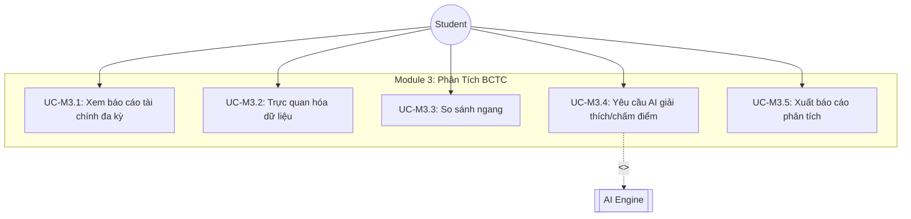
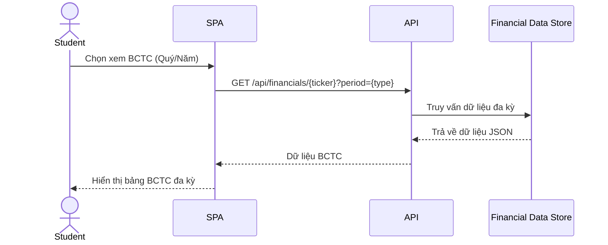
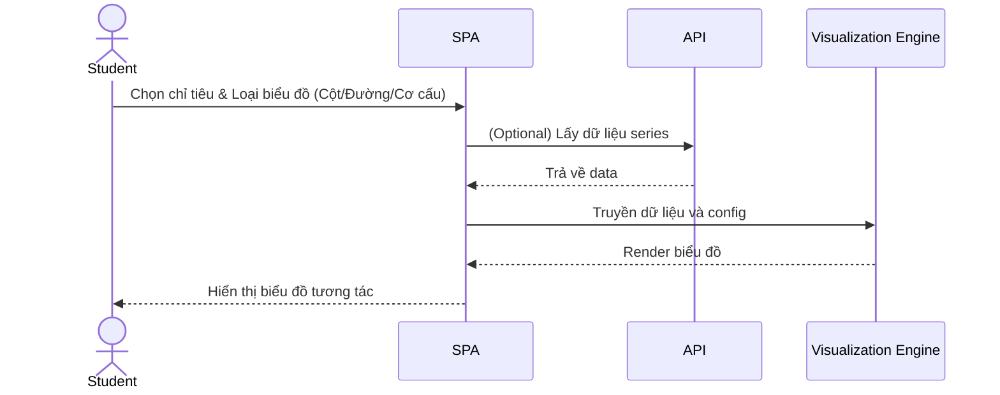
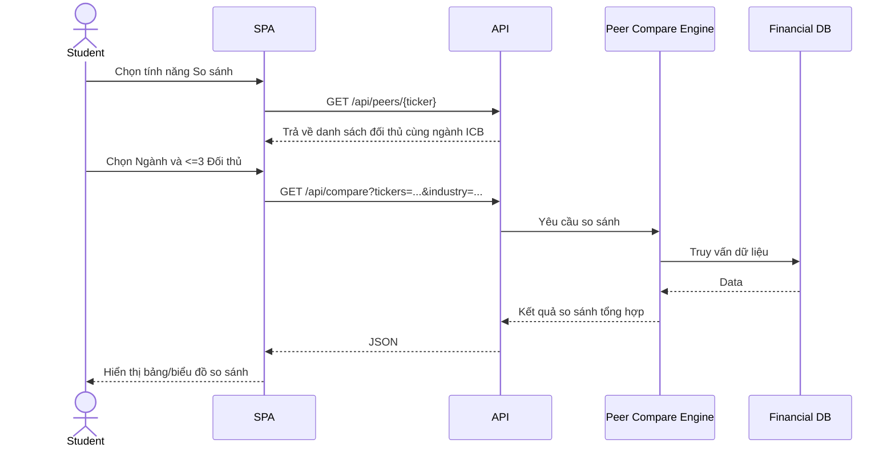
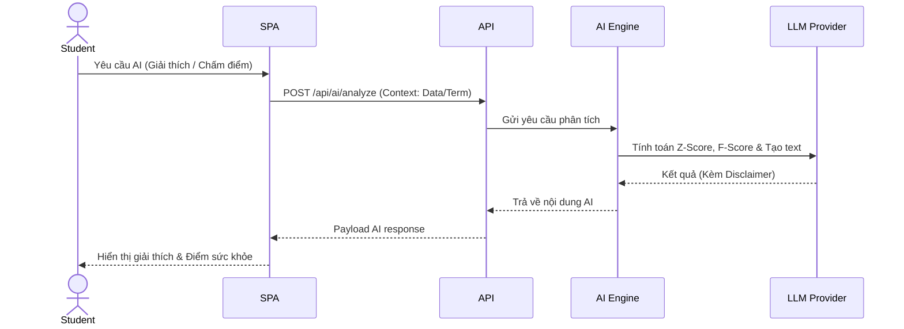
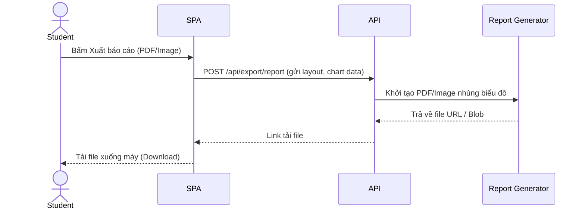

# Lớp 3 - Module 3: Phân Tích Báo Cáo Tài Chính (BCTC)

## Use Case Diagram

---

## UC-M3.1: Xem báo cáo tài chính đa kỳ (Quý/Năm)

### 1. Mô tả
Cho phép người dùng xem báo cáo tài chính (Bảng cân đối kế toán, Kết quả kinh doanh, Lưu chuyển tiền tệ) của doanh nghiệp qua nhiều kỳ (theo quý hoặc năm).

### 2. Actors
- Student (Người dùng cuối)

### 3. Pre-conditions
- Người dùng đang ở trang chi tiết của một mã chứng khoán (Ticker).

### 4. Main Flow
1. Người dùng chọn tab "Báo cáo tài chính".
2. Hệ thống hiển thị BCTC mặc định theo Năm của 4 năm gần nhất.
3. Người dùng chọn chế độ xem "Theo Quý" hoặc "Theo Năm".
4. SPA gửi yêu cầu lấy dữ liệu tới API.
5. API truy vấn Financial Data Store và trả về dữ liệu.
6. SPA render bảng dữ liệu tài chính đa kỳ.

### 5. Alternative Flows
- **Không có dữ liệu**: Nếu mã chứng khoán không có dữ liệu tài chính cho kỳ đã chọn, hệ thống hiển thị thông báo "Dữ liệu chưa được cập nhật".

### 6. Post-conditions
- Bảng dữ liệu BCTC hiển thị chính xác theo lựa chọn kỳ của người dùng.

### 7. Business Rules
> [!NOTE]
> Mặc định hiển thị dữ liệu 4 kỳ gần nhất để tối ưu hiển thị trên màn hình.

### 8. Sequence Diagram

---

## UC-M3.2: Trực quan hóa dữ liệu (Biểu đồ cột/đường/cơ cấu)

### 1. Mô tả
Cung cấp các công cụ biểu đồ để người dùng trực quan hóa các chỉ tiêu tài chính như doanh thu, lợi nhuận, cơ cấu tài sản/nguồn vốn.

### 2. Actors
- Student

### 3. Pre-conditions
- Đã tải thành công dữ liệu BCTC (UC-M3.1).

### 4. Main Flow
1. Người dùng click vào biểu tượng biểu đồ cạnh một chỉ tiêu tài chính hoặc chọn tab "Biểu đồ".
2. Người dùng chọn loại biểu đồ: Cột, Đường, hoặc Cơ cấu (Pie chart).
3. SPA gửi yêu cầu tới API (nếu cần xử lý thêm) hoặc gọi Visualization Engine trên frontend.
4. Visualization Engine xử lý dữ liệu và vẽ biểu đồ.
5. Hiển thị biểu đồ cho người dùng tương tác (hover xem chi tiết).

### 5. Alternative Flows
- **Chỉ tiêu không hỗ trợ biểu đồ cơ cấu**: Nếu người dùng chọn biểu đồ cơ cấu cho dữ liệu không phù hợp (ví dụ: một chỉ tiêu đơn lẻ thay vì tập hợp các thành phần), hệ thống disable tùy chọn cơ cấu.

### 6. Post-conditions
- Biểu đồ tương tác được hiển thị trên giao diện.

### 7. Business Rules
> [!NOTE]
> Biểu đồ cơ cấu chỉ áp dụng cho Bảng cân đối kế toán (Cơ cấu tài sản, Cơ cấu nguồn vốn) hoặc các chỉ tiêu có cấu thành phụ.

### 8. Sequence Diagram

---

## UC-M3.3: So sánh ngang (Peer Comparison) với ngành/3 đối thủ

### 1. Mô tả
Cho phép người dùng so sánh các chỉ số tài chính của một doanh nghiệp với trung bình ngành hoặc với tối đa 3 doanh nghiệp đối thủ cạnh tranh.

### 2. Actors
- Student

### 3. Pre-conditions
- Người dùng đang xem BCTC của một Ticker.

### 4. Main Flow
1. Người dùng chọn tính năng "So sánh ngang".
2. Hệ thống gợi ý trung bình ngành và danh sách các đối thủ cùng ngành.
3. Người dùng chọn tối đa 3 đối thủ để so sánh.
4. SPA gửi yêu cầu tới API So sánh.
5. Peer Compare Engine truy vấn Financial DB lấy dữ liệu của các mã liên quan.
6. Hệ thống tính toán và trả về bảng/biểu đồ so sánh.
7. SPA hiển thị kết quả so sánh.

### 5. Alternative Flows
- **Chọn quá số lượng**: Nếu người dùng chọn mã thứ 4, hệ thống hiển thị thông báo lỗi giới hạn.

### 6. Post-conditions
- Bảng và biểu đồ so sánh giữa Ticker gốc và các đối thủ/ngành được hiển thị.

### 7. Business Rules
> [!IMPORTANT]
> - Giới hạn so sánh: Tối đa 3 đối thủ trong cùng một biểu đồ để đảm bảo UI/UX.
> - Trung bình ngành: Tự động được chọn dựa trên phân loại ngành ICB của Ticker gốc.

### 8. Sequence Diagram

---

## UC-M3.4: Yêu cầu AI giải thích thuật ngữ/chấm điểm sức khỏe

### 1. Mô tả
Cung cấp tính năng AI hỗ trợ giải thích các thuật ngữ tài chính phức tạp và tự động chấm điểm sức khỏe tài chính của doanh nghiệp sử dụng mô hình Altman Z-Score và Piotroski F-Score.

### 2. Actors
- Student
- AI Engine (External/Internal service)

### 3. Pre-conditions
- Người dùng đã đăng nhập và có quyền sử dụng tính năng AI (tùy thuộc vào gói dịch vụ).

### 4. Main Flow
1. **Giải thích thuật ngữ**: Người dùng highlight một thuật ngữ BCTC và bấm "Hỏi AI".
2. **Chấm điểm sức khỏe**: Người dùng bấm nút "Phân tích sức khỏe tài chính bằng AI".
3. SPA gửi context (thuật ngữ hoặc dữ liệu BCTC) lên API.
4. API gọi tới AI Engine / LLM Provider.
5. AI Engine tính toán các chỉ số Z-Score, F-Score và gen ra nhận xét, hoặc giải thích thuật ngữ đơn giản dễ hiểu.
6. Trả kết quả về cho SPA hiển thị dạng popup hoặc panel.

### 5. Alternative Flows
- **AI Service Timeout**: Nếu dịch vụ LLM không phản hồi, hệ thống thông báo "Dịch vụ AI đang bận, vui lòng thử lại sau".

### 6. Post-conditions
- Kết quả giải thích hoặc báo cáo điểm sức khỏe hiển thị cho người dùng.

### 7. Business Rules
> [!IMPORTANT]
> Tất cả các phản hồi giải thích và nhận xét từ AI PHẢI đi kèm với dòng chữ (disclaimer): "Đây là phân tích tham khảo, không phải khuyến nghị đầu tư".

### 8. Sequence Diagram

---

## UC-M3.5: Xuất báo cáo phân tích (PDF/Image)

### 1. Mô tả
Cho phép người dùng xuất các dữ liệu, bảng biểu và báo cáo phân tích BCTC hiện tại ra định dạng PDF hoặc Hình ảnh để lưu trữ và chia sẻ.

### 2. Actors
- Student

### 3. Pre-conditions
- Màn hình BCTC đang hiển thị dữ liệu hoặc biểu đồ hợp lệ.

### 4. Main Flow
1. Người dùng bấm nút "Xuất báo cáo".
2. Chọn định dạng xuất (PDF hoặc Image).
3. SPA thu thập dữ liệu view hiện tại (bao gồm cả chart SVG/Canvas) và gửi yêu cầu tới API (hoặc xử lý trực tiếp bằng thư viện JS client-side).
4. API / Report Generator tạo file báo cáo, nhúng các biểu đồ và số liệu.
5. Hệ thống trả về link tải file.
6. Trình duyệt tự động tải xuống file báo cáo.

### 5. Alternative Flows
- Lỗi tạo file do nội dung quá lớn, hệ thống thông báo lỗi.

### 6. Post-conditions
- Người dùng tải được file PDF hoặc Hình ảnh chứa nội dung phân tích.

### 7. Business Rules
> [!NOTE]
> Báo cáo PDF xuất ra phải bao gồm watermark nền tảng và thời gian xuất dữ liệu.

### 8. Sequence Diagram

