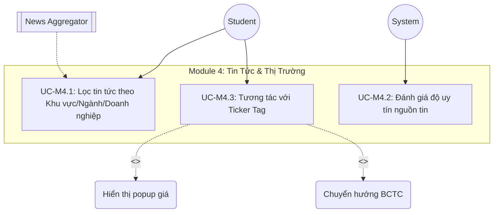
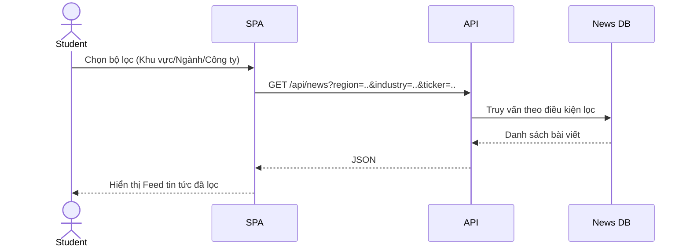
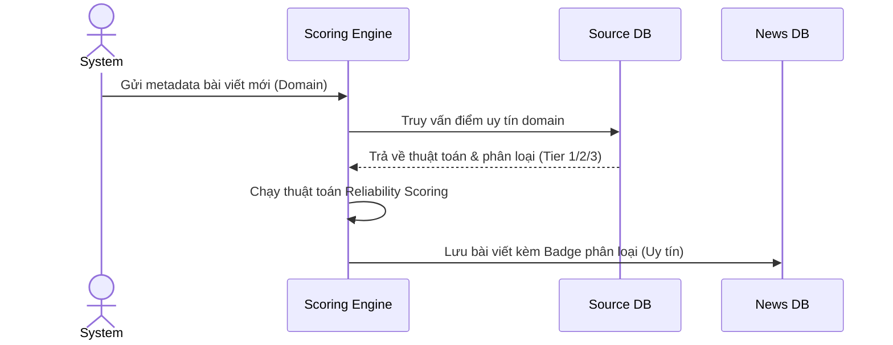
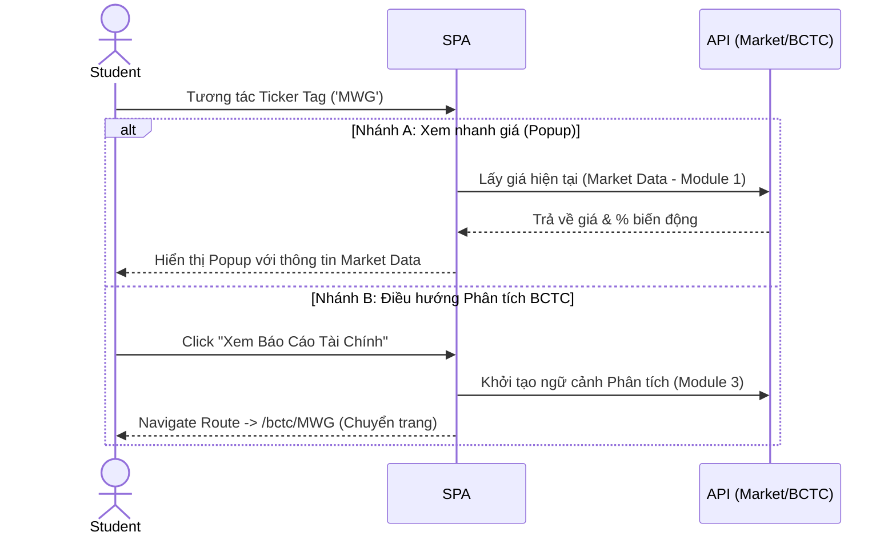

# Lớp 3 - Module 4: Tin Tức & Thị Trường

## Use Case Diagram

---

## UC-M4.1: Lọc tin tức theo Khu vực/Ngành/Doanh nghiệp

### 1. Mô tả
Cung cấp khả năng lọc dòng tin tức tài chính dựa trên các tiêu chí: Khu vực địa lý, Ngành nghề, hoặc một Doanh nghiệp cụ thể.

### 2. Actors
- Student
- News Aggregator (Bên cung cấp dữ liệu tin tức)

### 3. Pre-conditions
- Người dùng truy cập vào trang Tin tức.
- Hệ thống đã crawl/nhận data tin tức từ News Aggregator.

### 4. Main Flow
1. Người dùng thao tác trên thanh bộ lọc tin tức.
2. Người dùng chọn một hoặc nhiều bộ lọc: Khu vực, Ngành (ICB), hoặc gõ mã Doanh nghiệp.
3. SPA gửi yêu cầu tìm kiếm kèm tham số lọc tới API.
4. API truy vấn News DB theo các điều kiện lọc.
5. API trả về danh sách các bài viết phù hợp.
6. SPA render feed tin tức mới cho người dùng.

### 5. Alternative Flows
- **Không có kết quả**: Trả về giao diện empty state "Không tìm thấy tin tức phù hợp".

### 6. Post-conditions
- Giao diện hiển thị danh sách tin tức đúng với bộ lọc.

### 7. Business Rules
> [!NOTE]
> Mặc định nếu không chọn lọc, hiển thị tin tức mới nhất (Latest News) từ tất cả các danh mục.

### 8. Sequence Diagram

---

## UC-M4.2: Đánh giá độ uy tín nguồn tin

### 1. Mô tả
Hệ thống tự động đánh giá và gắn nhãn độ uy tín của nguồn tin (Tier 1, Tier 2, Tier 3) dựa trên các tiêu chí độ tin cậy để cảnh báo cho người dùng về chất lượng thông tin.

### 2. Actors
- System (Auto-scoring Engine)

### 3. Pre-conditions
- Bài báo mới được ingest từ external News Aggregator.

### 4. Main Flow
1. Bài viết mới được đưa vào hệ thống thông qua crawler/API.
2. System chuyển metadata bài viết (domain, tác giả) qua Scoring Engine.
3. Scoring Engine kiểm tra domain đối chiếu với Source DB đã được phân loại uy tín trước đó.
4. Hệ thống phân loại độ uy tín của bài viết (VD: Tier 1 - Báo chí chính thống, Tier 2 - Trang tin tổng hợp, Tier 3 - Nguồn tin đồn, diễn đàn).
5. Lưu trữ kết quả phân loại vào CSDL tin tức.

### 5. Alternative Flows
- **Nguồn mới chưa xác định**: Gắn nhãn mặc định là "Chưa xác minh" hoặc "Tier 3" cho đến khi admin cập nhật.

### 6. Post-conditions
- Tin tức hiển thị trên frontend có gắn badge phân loại uy tín (Tier 1/2/3).

### 7. Business Rules
> [!IMPORTANT]
> Thuật toán đánh giá độ uy tín ưu tiên phân loại Tier 1 cho các cơ quan báo chí nhà nước và các tổ chức tài chính lớn, Tier 3 đối với mạng xã hội, diễn đàn đầu tư.

### 8. Sequence Diagram

---

## UC-M4.3: Tương tác với Ticker Tag

### 1. Mô tả
Trong nội dung bài viết tin tức, các mã chứng khoán (VD: MWG, FPT) sẽ được tự động nhận diện và gắn thẻ (Ticker Tag). Người dùng có thể click vào các tag này để xem nhanh giá cổ phiếu (Module 1) hoặc chuyển hướng sang phân tích sâu BCTC (Module 3). Đây là Use Case cốt lõi liên kết chéo các Module.

### 2. Actors
- Student

### 3. Pre-conditions
- Bài báo có chứa các Ticker đã được nhận diện tự động thành link/tag.

### 4. Main Flow
1. Người dùng đang đọc báo và click/hover vào một Ticker Tag (ví dụ: 'MWG').
2. Hệ thống xử lý tương tác của người dùng.
   - **Nhánh A (Hover/Click xem nhanh)**: SPA gọi API Market Data lấy giá hiện tại, hiển thị dạng Popup thu nhỏ ngay trên bài viết.
   - **Nhánh B (Click chuyển phân tích)**: Người dùng chọn chức năng "Phân tích BCTC", hệ thống điều hướng thẳng sang trang Phân tích BCTC (Module 3) của mã 'MWG'.

### 5. Alternative Flows
- **Lỗi tải dữ liệu giá**: Popup hiển thị thông báo "Dữ liệu thị trường đang gián đoạn".

### 6. Post-conditions
- Người dùng nhận được thông tin tóm tắt thị trường, hoặc được điều hướng thành công sang Module Phân tích BCTC.

### 7. Business Rules
> [!IMPORTANT]
> Tính năng này là cầu nối (cross-module integration) giữa Tin Tức, Market Data và Phân tích BCTC. Ticker tags phải được tự động sinh ra khi parse nội dung bài viết.

### 8. Sequence Diagram

