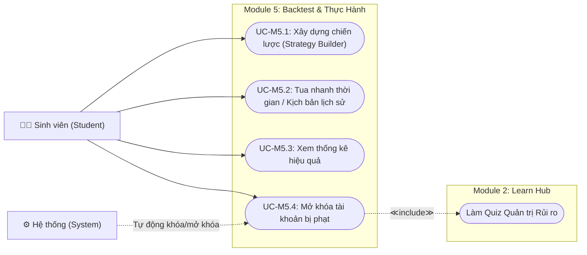
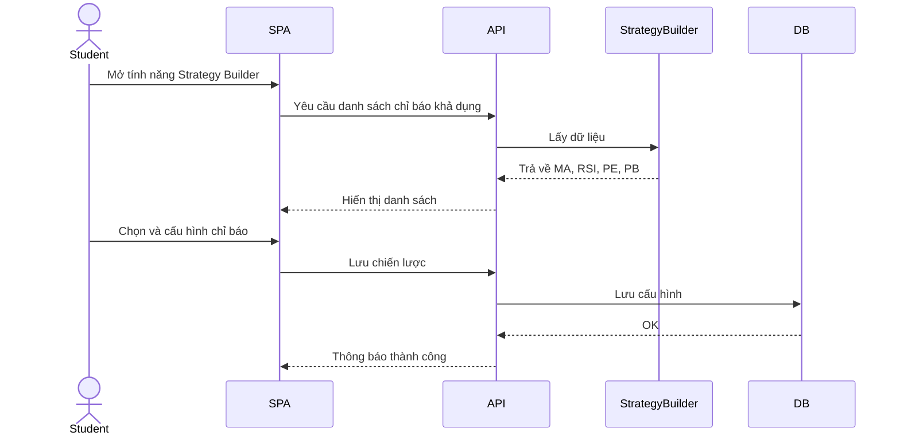
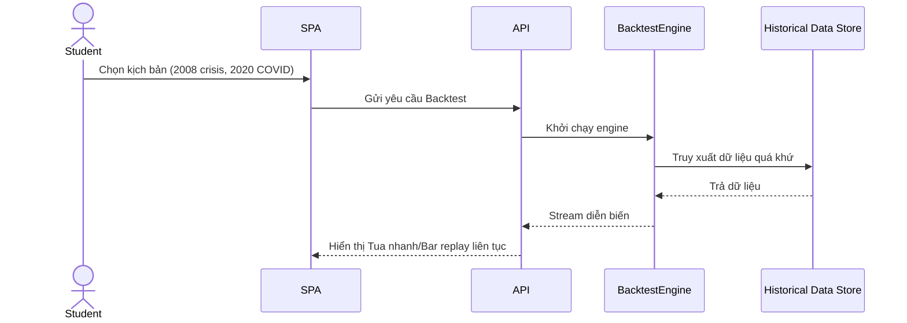
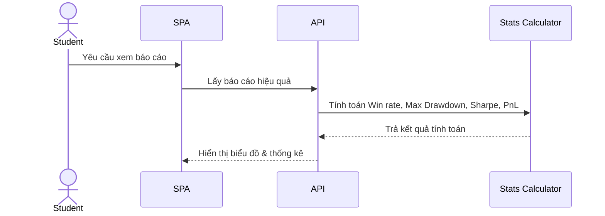
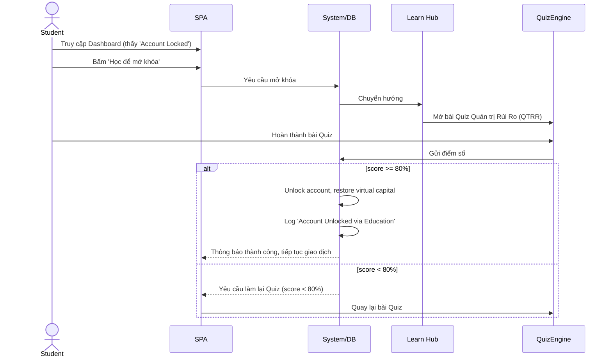

# Lớp 3 - Module 5: Backtest & Thực Hành

## Biểu đồ Use Case (Use Case Diagram)

---

## Chi tiết Use Case & Sequence Diagrams

### UC-M5.1: Xây dựng chiến lược (Strategy Builder)

**Mô tả:** Cho phép sinh viên thiết lập chiến lược giao dịch dựa trên các chỉ số Cơ bản và Kỹ thuật.
**Actors:** Sinh viên
**Điều kiện trước (Pre-conditions):** Sinh viên đã đăng nhập và hoàn thành các bài học cơ bản về chỉ số (Learn Hub).
**Luồng chính (Main Flow):**
1. Sinh viên truy cập tính năng Strategy Builder.
2. Sinh viên chọn các chỉ báo (MA, RSI, PE, PB).
3. Hệ thống lưu cấu hình và xác nhận thành công.
**Luồng thay thế (Alternative Flows):** Nếu chỉ báo chưa được học, hệ thống cảnh báo và gợi ý bài học.
**Điều kiện sau (Post-conditions):** Chiến lược được lưu và sẵn sàng để chạy Backtest.

> [!IMPORTANT]
> Quy tắc nghiệp vụ (Business Rules): Sinh viên chỉ được sử dụng các chỉ báo đã mở khóa trong Learn Hub.

---

### UC-M5.2: Tua nhanh thời gian (Bar Replay) / Chạy kịch bản lịch sử

**Mô tả:** Sinh viên chạy thử chiến lược trên dữ liệu quá khứ hoặc tua nhanh thời gian trên biểu đồ.
**Actors:** Sinh viên
**Điều kiện trước:** Có ít nhất 1 chiến lược hợp lệ.
**Luồng chính:**
1. Sinh viên chọn chiến lược.
2. Sinh viên chọn kịch bản lịch sử (2008, 2020) hoặc Bar Replay.
3. Hệ thống chạy giả lập và hiển thị diễn biến theo thời gian.
**Luồng thay thế:** Thiếu dữ liệu của kịch bản, hệ thống thông báo lỗi.
**Điều kiện sau:** Hoàn tất giả lập, sinh viên có thể xem kết quả.

---

### UC-M5.3: Xem thống kê hiệu quả

**Mô tả:** Xem chi tiết các chỉ số thống kê hiệu suất của chiến lược vừa chạy.
**Actors:** Sinh viên
**Điều kiện trước:** Hoàn thành ít nhất một lần chạy giả lập (UC-M5.2).
**Luồng chính:**
1. Hệ thống tự động tính toán số liệu ngay sau khi giả lập kết thúc.
2. Sinh viên mở bảng thống kê để xem Win rate, Max Drawdown, Sharpe, PnL.
**Điều kiện sau:** Không có.

---

### UC-M5.4: Mở khóa tài khoản bị phạt

**Mô tả:** Khi tài khoản bị phạt do giao dịch sai nguyên tắc, sinh viên phải hoàn thành bài Quiz Quản trị Rủi Ro (QTRR) tại Learn Hub để được mở khóa.
**Actors:** Sinh viên, Hệ thống (tự động khóa/mở khóa)
**Điều kiện trước:** Tài khoản đang bị khóa do PnL < -50% hoặc vi phạm cắt lỗ (stop-loss) 3 lần liên tiếp.
**Luồng chính:**
1. Sinh viên thấy thông báo 'Account Locked' và bấm 'Học để mở khóa'.
2. Hệ thống chuyển hướng sang Learn Hub.
3. Sinh viên làm bài Quiz Quản trị Rủi Ro.
4. Hệ thống chấm điểm:
   - Nếu >= 80%: Hệ thống mở khóa tài khoản, khôi phục vốn ảo, ghi log.
   - Nếu < 80%: Yêu cầu làm lại.
**Điều kiện sau:** Tài khoản được mở khóa hoặc sinh viên phải làm lại bài kiểm tra.

> [!CAUTION]
> Quy tắc nghiệp vụ (Business Rules): 
> - Điều kiện khóa: PnL < -50% HOẶC vi phạm stop-loss 3 lần liên tiếp.
> - Số lần mở khóa: Tối đa 3 lần/tháng. Lần thứ 4 yêu cầu liên hệ Admin/Instructor.

