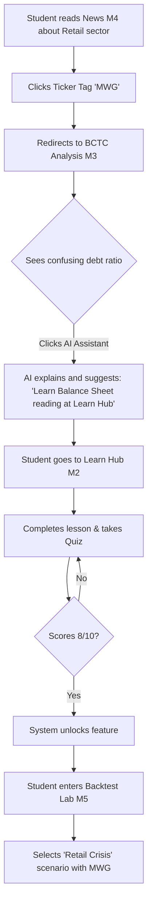
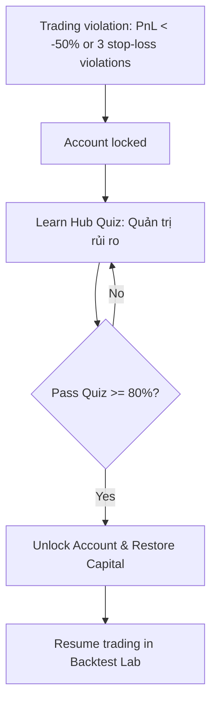
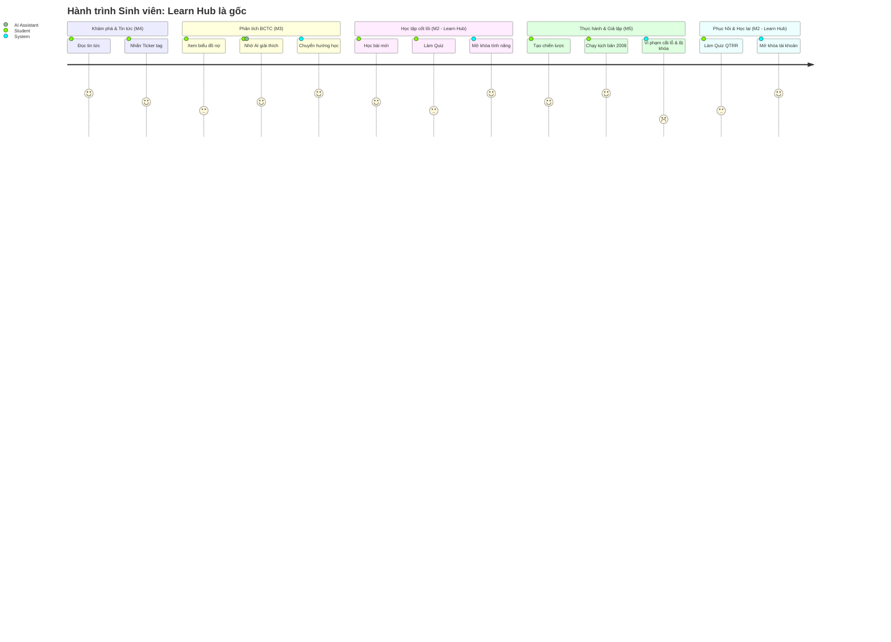

# Lớp 4: Sơ đồ Luồng Nghiệp vụ Chéo (Cross-Module Integration)

## 1. Hành trình Từ Tin tức đến Thực hành

---

## 2. Luồng Phạt Giáo Dục (Education Penalty Flow)

---

## 3. Bản đồ Hành trình Người dùng (User Journey Map) - Vai trò trung tâm của Learn Hub

