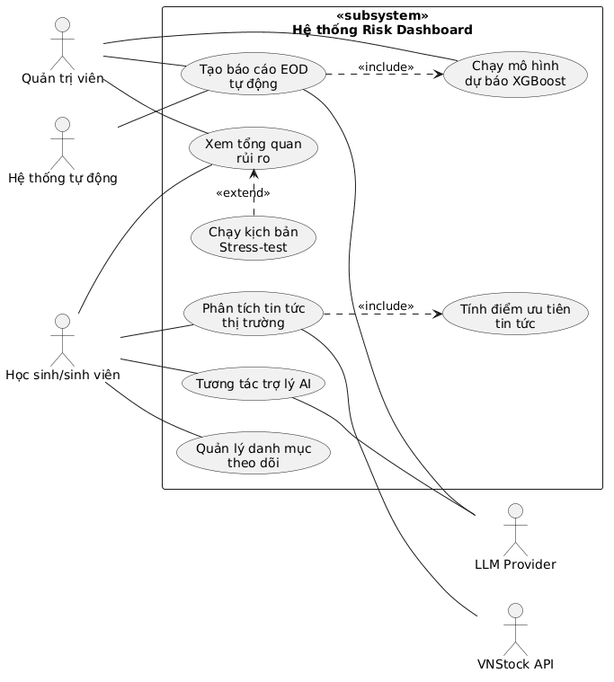
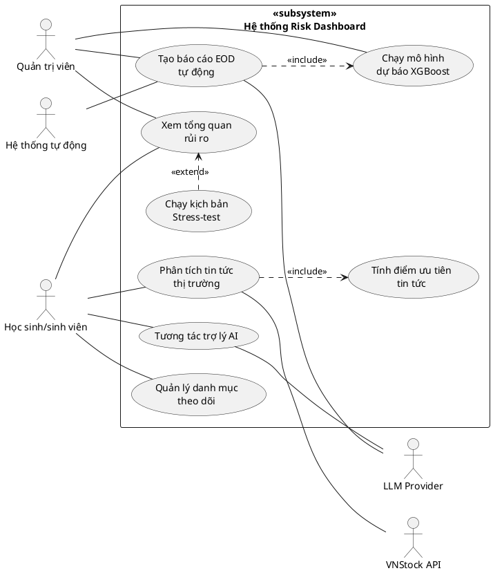
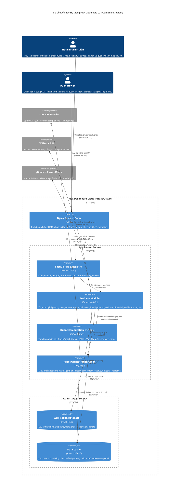

# PlantUML Render Test File

This file contains the exact Use Case diagram using standard **PlantUML** syntax, preserving all standard notations, and links to the rendered image representation below.

---

## 1. UML 2.5 Use Case Diagram (PlantUML Render)

Here is the rendered diagram:

Below is the exact raw PlantUML code:

---

## 2. System Architecture (C4 Container Diagram)

